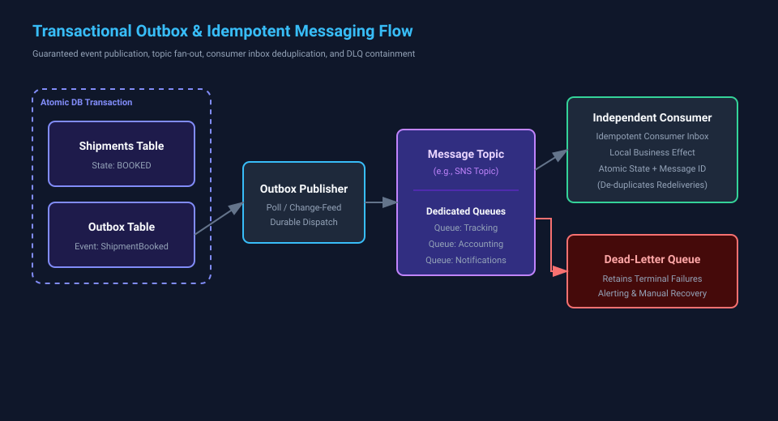

# Chapter 3 — The Shipment Leaves a Message

## Events, Asynchronous Reactions, and Reliable Publication

**Estimated listening time:** 18–21 minutes

**Primary evidence label:** Teaching example

**Teaching-chapter status:** Technical Review

**Reference implementation:** Atlas Enterprise Platform

## What You Will Learn

By the end of this chapter, you should be able to:

- Distinguish a command from an event by intent, ownership, and tense.
- Define `ShipmentBooked` as a precise business fact rather than a vague notification.
- Explain why booking and event-publication intent must be committed atomically.
- Describe SNS fan-out with one SQS queue per independent consumer.
- Design for at-least-once delivery using idempotency, bounded retries, dead-letter handling, and reconciliation.
- Identify which downstream reactions may be delayed without weakening the shipment-booking invariant.

## Evidence Guide

This chapter continues to distinguish the course’s intended responsibility model from verified implementation.

- **Implemented** — Behavior linked to code, configuration, tests, or operational evidence in the repository.
- **Current architecture** — A description linked to an authoritative current-state artifact.
- **Planned direction** — An intended change whose completion criteria or trigger is stated.
- **Teaching example** — A concrete scenario used to explain a design decision.
- **Conceptual extension** — A possible evolution used to explore a tradeoff, not a committed roadmap item.

Until implementation evidence is linked, detailed runtime examples in this chapter are **Teaching example**. Present-tense descriptions of Atlas refer to the course’s intended responsibility model, not to verified deployed behavior.

---

## Narration

The customer clicked **Book Shipment**.

Atlas established identity and checked authority at the resource boundary. It translated the request, selected a carrier adapter, and interpreted the outcome.

The carrier accepted the booking. Atlas now owns a truthful record of that result.

The user can receive a response.

But the shipment journey has created work for other parts of the business.

The customer may need an email. Accounting may need a chargeable shipment record. Tracking may need to begin polling or accepting carrier updates. Analytics may need the booking fact. A warehouse screen may need to refresh. None of those reactions changes whether the carrier accepted the booking.

That distinction is our starting point.

Booking is the authoritative business operation. Notification, accounting intake, tracking, and analytics react to its result.

If Atlas performs every reaction inside the booking request, the user waits for systems that do not determine booking success. An unavailable email provider can make a successful carrier booking appear to fail. A slow analytics service can consume the request deadline. A retry of the whole request can create duplicate external effects.

Instead, the saved shipment leaves a message.

### Commands ask; events state

A command expresses intent.

`BookShipment` asks a responsible component to attempt a state change. The request can succeed, be rejected, or fail. It has one logical owner: the component that decides whether the action is valid.

An event states that something already happened.

`ShipmentBooked` does not ask accounting to create an intake record. It does not ask notifications to send an email. It announces a fact that Atlas has already made authoritative.

Several consumers may react. Any one of them may decide that no action is necessary.

The grammar is useful:

```text
Command: BookShipment
Event:   ShipmentBooked
```

Commands are imperative. Events are past tense.

The tense is not cosmetic. A message named `BookShipment` carries a request whose outcome is still open. A message named `ShipmentBooked` must not be published until Atlas can stand behind that statement.

This gives us the first rule of event design:

> Publish a business event only after the fact it names is authoritative.

### What `ShipmentBooked` means

A useful event has a definition that remains true when every consumer is offline.

In the course’s intended responsibility model, `ShipmentBooked` means:

> Atlas has recorded a carrier-accepted shipment booking as authoritative Atlas state, including the identifiers required to refer to that booking.

It does not mean:

- the label was printed
- the customer was notified
- an accounting intake record or projection was created
- an authoritative financial posting was approved or completed
- the package was collected
- tracking has begun
- the shipment was delivered

Those may become separate facts later.

The event should carry enough stable information for consumers to identify the fact and decide what to do. A teaching example might include:

```text
eventId
eventType
occurredAt
shipmentId
tenantId
carrierCode
carrierShipmentReference
bookingVersion
schemaVersion
correlationId
causationId
```

This is not permission to copy the entire shipment database row into a message. Event contracts should expose durable business meaning, not accidental persistence structure or carrier SDK models.

The `eventId` identifies this publication. The `shipmentId` identifies the business entity. The booking version helps consumers detect stale work.

The `correlationId` connects the wider shipment journey. The `causationId` identifies the command or event that directly produced this event. Tenant context supports isolation and diagnostics. The schema version makes contract evolution explicit.

Sensitive data should be omitted unless a consumer demonstrably requires it. An event broker is not a shortcut around data minimization or tenant boundaries.

### Which work may be delayed?

The answer follows from the invariant.

The booking path must establish truthful shipment state. Work that is not required to make that state true may occur later.

For this teaching example, customer notification, analytics, tracking initialization, and accounting intake may be delayed within defined objectives. A delay may be operationally important. It does not reverse the carrier’s acceptance.

An authoritative financial posting is different. It may require stronger sequencing, reconciliation, approval, audit, or regulatory controls. We should not call every financial effect delay-tolerant merely because an accounting consumer receives the event.

Atlas must not defer the decision that makes the booking authoritative and then publish `ShipmentBooked` as if that decision were complete. It must also retain the data needed to reconcile an uncertain carrier result.

The boundary is not “important work versus unimportant work.” Accounting and notification can be important. The boundary is “work required for the authoritative transaction versus an independent reaction to its result.”

### The dual-write failure

Suppose the application service saves the shipment and then publishes directly to a broker:

```text
1. UPDATE shipment ...
2. COMMIT
3. PUBLISH ShipmentBooked
```

What happens if the process stops after step two?

The shipment is booked, but no event exists. Downstream systems never learn about it.

Reverse the order:

```text
1. PUBLISH ShipmentBooked
2. UPDATE shipment ...
3. COMMIT
```

Now the process can stop after publication. Consumers react to a booking that Atlas did not record as authoritative.

These are two unrelated writes to two systems. Changing the order merely changes which inconsistency is possible.

A distributed transaction may appear to solve the problem. In practice, the database and cloud broker usually do not participate in one atomic transaction. Holding a database transaction open during the broker call does not change that fact.

The design needs one local atomic decision.

### The transactional outbox

The transactional outbox records the business change and publication intent in the same local database transaction.

```text
BEGIN
  persist authoritative shipment state
  insert outbox record for ShipmentBooked
COMMIT
```

If the transaction rolls back, neither record exists.

If it commits, both exist.

The outbox record is not yet proof that SNS received the message. It is proof that Atlas durably intends to publish a fact that is already authoritative.

A separate publisher reads pending outbox records and sends them to the broker. It then records publication progress.

At minimum, the record distinguishes `pending` from `published`. It also retains the attempt count, the last-attempted time, and the last failure classification. If the publisher stops, the intent remains durable and can be retried.

This changes the failure mode from silent loss to visible backlog.

A backlog can be measured, alerted on, replayed, and reconciled. A missing event with no durable trace cannot. That is the reliability improvement.

The architecture principle is exact:

> Preserve the authoritative business fact first, then distribute independent reactions through durable and observable messaging.

### Publication duplication and delivery duplication

The outbox closes the loss gap, but it does not create exactly-once delivery.

Imagine that the publisher sends an event and SNS accepts it. Before the publisher records success, the process stops. On restart, the outbox row still appears unpublished, so the publisher sends it again.

That is the correct recovery choice. Losing the event would be worse than delivering it twice.

This is **publication duplication**: the outbox publisher republishes the same event because it cannot prove that the earlier publication completed.

**Delivery duplication** occurs later. The queue redelivers because the consumer did not acknowledge successfully.

The two paths have different owners and evidence. Both require the consumer effect to be idempotent.

The event retains the same `eventId` when the same outbox record is republished. Consumers can use that identifier to recognize that they already applied the effect.

“Exactly once” is often a local property presented as an end-to-end guarantee. A broker may deduplicate within a window. A database may enforce a unique key. Neither proves that an external email, payment, or carrier action happened exactly once across every failure boundary.

The honest system promises at-least-once delivery and designs business effects to be idempotent.

### Fan-out preserves consumer independence

One event may have several interested consumers.

In the intended topology, Atlas publishes the event to an SNS topic. SNS fans the message out to one SQS queue per independent consumer.

```text
                         ┌─ notification queue ─ notification consumer
ShipmentBooked ─ SNS ───┼─ accounting-intake queue ─ intake consumer
                         ├─ tracking queue ───── tracking consumer
                         └─ analytics queue ──── analytics consumer
```

Each queue has its own delivery state, retry behavior, throughput, and failure isolation.

If analytics is unavailable, notification can continue. If tracking needs a longer visibility timeout, it does not impose that policy on accounting intake. If one consumer accumulates poison messages, the others do not lose their copies of the event.

A single shared queue creates competing consumption. One consumer receives a message; the others do not. That works when several workers perform the same responsibility. It does not distribute one fact to independent responsibilities.

The topology therefore follows ownership:

> Independent business effects receive independent queues.

### Each consumer owns its effect

The publisher owns durable publication. The broker owns transport within its contract. Each consumer owns the correctness of its reaction.

Consider a consumer that creates an accounting intake record or projection. This is not the authoritative financial posting itself.

It receives `ShipmentBooked` and writes the projection. Only then does it acknowledge the message.

If the process stops after the database write but before acknowledgement, SQS makes the message visible again.

Without idempotency, accounting may create the projection twice.

A common local pattern is to record the event identifier in the same transaction as the consumer’s business effect:

```text
BEGIN
  if eventId has already been processed:
      do nothing
  else:
      apply accounting intake or projection effect
      record eventId as processed
COMMIT
ACK message
```

The invariant is direct: the processed-event marker and the business effect commit atomically in the consumer’s authoritative store. The queue message is acknowledged only after that transaction succeeds. A unique constraint on the marker makes concurrent duplicates deterministic.

Idempotency belongs at the business-effect boundary. An in-memory check disappears after restart. Message deduplication does not undo a non-idempotent external effect that already occurred.

For email, the consumer may use a stable delivery key with a provider that supports idempotency, or maintain a durable send record and reconciliation process. For a projection, an upsert keyed by shipment and version may be appropriate. For tracking initialization, the consumer may record that the shipment is already registered.

The technique varies because the effect varies. Ownership stays with the consumer that understands that effect.

### Retries need a budget

Retries help when failure is transient. They cause harm when failure is permanent, the request is not idempotent, or the dependency is overloaded.

A consumer should classify failures deliberately.

- A short network interruption may justify retry.
- A throttled dependency may require backoff and jitter.
- A malformed event will not improve through repetition.
- A schema version the consumer cannot understand requires intervention or compatibility handling.
- A tenant-authority violation must not be retried as though it were a timeout.

Retry policy should be bounded. Infinite retries turn one poison message into permanent queue congestion and obscure the age of useful work behind it.

Useful evidence includes attempt count, next visibility time, oldest-message age, failure classification, and correlation identifiers. A retry should make progress or produce a diagnosable terminal state. Merely trying again is not enough.

### Dead-letter queues are evidence, not disposal

After the retry budget is exhausted, the message can move to a dead-letter queue.

A DLQ prevents one persistently failing message from blocking healthy traffic. It does not complete the business work.

Every DLQ needs an owner and a recovery procedure:

1. Detect that messages arrived.
2. Diagnose the failure using event and correlation context.
3. Correct code, configuration, data, or dependency state.
4. Decide whether replay is safe.
5. Redrive the message through a controlled path.
6. Verify the business effect, not merely an empty queue.

Deleting a DLQ message because the alarm is noisy is data loss with better observability.

### Ordering is scoped, not global

Events can arrive out of order. A retry of an older event may appear after a newer event. Different queues progress independently. A replay can reintroduce historical events.

Many consumers do not need global ordering. They need enough information to reject stale work for one business entity.

A shipment version can help:

```text
ShipmentBooked      shipmentId=123 version=4
ShipmentLabelReady  shipmentId=123 version=5
```

A projection that has already applied version five should not regress to version four. A consumer can record the highest applied version or evaluate the authoritative source when sequence is uncertain.

Ordering guarantees cost throughput and availability. Require them only where the business invariant demands them.

### Reconciliation closes the operational loop

Idempotency and retries handle expected delivery behavior. Reconciliation detects what those mechanisms missed.

An outbox reconciler can find committed records that remain unpublished beyond an objective. A consumer reconciler can compare authoritative shipments with downstream projections. An operator can ask:

- Which booked shipments have no published event?
- Which outbox records are older than the publication objective?
- Which consumer queue contains messages older than its processing objective?
- Which booked shipments lack an accounting intake, notification, or tracking result?
- Which DLQ messages have no assigned incident or recovery decision?

Reconciliation matters because the system crosses ownership boundaries. A green publisher metric does not prove that every consumer effect completed. An empty queue does not prove that a consumer wrote the correct state.

The evidence must follow the business fact from authoritative commit through publication and each required reaction.

### The end-to-end story

The Tuesday shipment journey now looks like this:

```text
Carrier accepts booking
      ↓
Atlas commits shipment state and outbox intent atomically
      ↓
Outbox publisher sends ShipmentBooked
      ↓
SNS fans out to independent SQS queues
      ↓
Each consumer applies an idempotent effect
      ↓
Retries handle bounded transient failure
      ↓
DLQs retain terminal failures for owned recovery
      ↓
Reconciliation checks that business outcomes converge
```



*(Related Decisions: [ADR-0003 — Transactional Outbox](../adr-examples/ADR-0003-transactional-outbox.md) | [ADR-0004 — Idempotent Message Consumption](../adr-examples/ADR-0004-idempotent-message-consumption.md) | Hands-on Practice: [Exercise 3 — Break the Message Flow](../exercises/exercise-03-break-the-message-flow.md))*

The network is not atomic. The design does not pretend otherwise.

### What's Next?

With reliable request processing and asynchronous event distribution in place, we must confront the reality that distributed systems operate in hostile environments with multiple tenants, external credentials, and automation workflows.

In **Chapter 4 — Security**, we examine identity, authority, data protection, secret management, and supply-chain boundaries across both shipping operations and engineering agent pipelines.

**Narrated-edition note:** The narration ends here. Editorial Alignment, Engineering Commentary, Interview Stops, the review exercise, checklists, and the editorial record remain in Markdown as review and instructor material and may be excluded from the narrated edition.

---

## Editorial Alignment

This chapter preserves the review edition’s controlling statements:

- **Preserved decisions:** Shipment state and event-publication intent commit in one local transaction. Each independent consumer owns its queue, retries, DLQ, and business effect. Duplicate delivery is expected and handled rather than denied.
- **Architecture principle:** Preserve the authoritative business fact first, then distribute independent reactions through durable and observable messaging.
- **Anti-pattern:** Saving the shipment and publishing directly to the broker as two unrelated writes.

The chapter answers the review questions as follows:

1. `ShipmentBooked` means Atlas has recorded a carrier-accepted booking as authoritative Atlas state, including the identifiers required to refer to it.
2. Notification, analytics, tracking initialization, and downstream accounting intake records or projections may be delayed within explicit objectives because they do not determine booking validity. Authoritative financial posting may require stronger controls.
3. Each consumer makes its business effect idempotent using a durable event or business key, atomic local recording, and effect-specific reconciliation.
4. Detailed runtime examples remain teaching examples until linked repository evidence supports stronger labels.

---

## Engineering Commentary

### Why an outbox instead of direct publication?

Direct publication creates a dual-write gap between the database and broker. The outbox reduces the atomic boundary to one database transaction and turns publication failure into durable, observable backlog. It does not guarantee immediate delivery or exactly-once processing.

### Why SNS plus one SQS queue per consumer?

SNS expresses distribution of one fact. Separate SQS queues give independent consumers durable delivery state and isolate their throughput, retries, and failures. Workers that perform the same responsibility may share a queue; different responsibilities should not compete for one copy.

### Why not exactly once?

End-to-end exactly-once claims usually omit a failure boundary. A sender can lose an acknowledgement, a consumer can stop after applying an effect, or an external provider can accept a request before timing out. At-least-once delivery plus business idempotency states the real responsibility clearly.

### Event contracts and privacy

Events should carry stable business meaning and the minimum information consumers need. Carrier SDK objects, secrets, and unnecessary personal information stay out of the contract. Tenant context helps consumers enforce isolation but does not replace authorization.

### Where this chapter needs implementation evidence

Before marking the described flow as **Implemented**, link it to:

- Shipment persistence and the authoritative booked-state transition.
- The outbox schema, repository, and local transaction boundary.
- The outbox publisher, retry behavior, and publication-state handling.
- SNS topic and per-consumer SQS queue configuration.
- Event schema and compatibility tests.
- Consumer idempotency stores or unique constraints.
- Queue retry and DLQ redrive policies.
- Tests for commit rollback, publisher interruption and publication duplication, consumer interruption and delivery duplication, poison messages, and replay.
- Operational evidence for outbox age, queue age, DLQ depth, and reconciliation results.

---

## Interview Stops

Pause after each question and answer it aloud before reading the response.

### Senior Engineer

**Question:** Why not publish `ShipmentBooked` directly after saving the shipment?

**Answer:** Because the database commit and broker publication are separate writes. A process failure between them can leave a booked shipment with no event. The outbox records shipment state and publication intent atomically, allowing publication to recover later.

### Principal Engineer

**Question:** Has the outbox solved distributed consistency?

**Answer:** It solves one specific gap: atomic persistence of the authoritative fact and the intent to publish it. Publication and consumer effects still occur later, may be duplicated, and require monitoring, idempotency, and reconciliation.

### Reliability Engineer

**Question:** The consumer wrote its projection but stopped before acknowledging the message. What happens next?

**Answer:** The message becomes visible again. The consumer uses the stable event or business key to recognize that the effect was already committed and acknowledges the duplicate without applying it twice.

### Security Architect

**Question:** Is a tenant ID in the event enough to authorize consumer access?

**Answer:** No. It is routing and context data, not self-authenticating authority. The consumer still operates under a least-privilege workload identity, validates the event’s trusted source and contract, and enforces tenant isolation for the data it reads or writes.

### Skeptical Reviewer

**Question:** Why introduce SNS, SQS, an outbox, retries, and DLQs instead of making synchronous calls?

**Answer:** The boundary is justified only where reactions are independent, may lag safely, and need failure isolation. If one required action is part of booking validity, it belongs in the authoritative workflow. Messaging is not a default architecture style; it addresses demonstrated temporal and ownership separation.

---

## Key Takeaways

1. Commands request change; events state authoritative facts.
2. `ShipmentBooked` must have a precise meaning independent of its consumers.
3. Downstream work can be delayed only when it is outside the booking invariant.
4. A transactional outbox commits shipment state and publication intent atomically.
5. Publication duplication occurs when the publisher cannot confirm success; delivery duplication occurs when a consumer does not acknowledge successfully.
6. SNS distributes a fact; independent SQS queues isolate consumer responsibilities.
7. Duplicate publication or delivery is expected, so each consumer owns an idempotent business effect.
8. Retries are bounded, classified, observable, and owned.
9. DLQs retain failed work for recovery; they are not disposal bins.
10. Ordering should be scoped to the business entity and invariant that require it.
11. Reconciliation verifies business convergence beyond transport-level success.

## Related Concepts

- Domain events and integration events
- Transactional outbox and change-data capture
- At-least-once delivery and idempotent consumers
- Publish-subscribe and competing consumers
- Retry budgets, exponential backoff, and jitter
- Dead-letter queues and controlled redrive
- Event schema evolution
- Per-entity ordering and optimistic versioning
- Eventual consistency and reconciliation
- Correlation, causation, and observability

## Review Exercise

Design the publication and consumption path for `ShipmentBooked` under these constraints:

- Atlas uses a relational database for shipment state.
- Notification, accounting intake, tracking, and analytics are independent consumers.
- The broker and every consumer may be unavailable temporarily.
- Messages may be delivered more than once or out of order.
- A tenant must never observe another tenant’s shipment data.

Produce:

1. The exact event definition and minimum contract.
2. The local transaction boundary for shipment state and publication intent.
3. The topic and queue topology.
4. One idempotency strategy per consumer.
5. Retry classification and budget.
6. DLQ ownership and redrive procedure.
7. Reconciliation queries or checks.
8. Metrics proving publication and downstream convergence.

Then explain the recovery sequence for this failure:

> Atlas commits the shipment and outbox row. The publisher sends the event, SNS accepts it, and the publisher stops before recording success. The accounting-intake consumer processes the first delivery and stops before acknowledging it.

Your answer should identify publication duplication separately from delivery duplication and show why no correct business effect is lost or applied twice. Also state which additional controls would be required if the downstream effect were an authoritative financial posting rather than an intake projection.

## Chapter Checklist

- [x] The lesson continues the shipment journey.
- [x] Commands and events are distinguished by intent and tense.
- [x] `ShipmentBooked` has a precise business definition.
- [x] The authoritative fact and local transaction boundary are explicit.
- [x] The transactional outbox and dual-write failure are explained.
- [x] Fan-out and per-consumer queue ownership are explained.
- [x] At-least-once delivery, retries, idempotency, DLQs, ordering, and reconciliation are covered.
- [x] Editorial Alignment matches the review edition.
- [ ] Implementation claims are linked to repository evidence.
- [x] Chapter has been read aloud and edited for pacing.
- [ ] Technical review is complete.
- [ ] Editorial review is complete.

## Editorial Record

- **Teaching-chapter status:** Technical Review
- **Owner:**
- **Reviewers:**
- **Evidence links:**
- **Related ADRs:** ADR-0004, ADR-0005, ADR-0010
- **Open questions:** Confirm the implemented outbox mechanism, broker topology, consumer idempotency stores, retry budgets, and reconciliation ownership before promoting any runtime claim beyond Teaching example.
