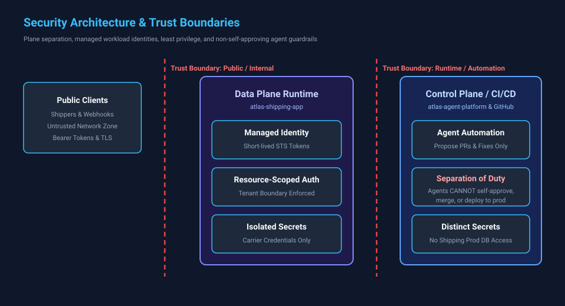

# Chapter 4 — Security

## Identity, Authority, Data Protection, and Supply-Chain Boundaries

**Estimated listening time:** 22–26 minutes  
**Primary evidence label:** Teaching example  
**Teaching-chapter status:** Ready  
**Reference implementation:** Atlas Enterprise Platform

## What You Will Learn

By the end of this chapter, you should be able to:

- Distinguish authentication from authorization.
- Explain why tenant isolation must be enforced at the resource boundary.
- Identify trust boundaries in the Atlas request and event paths.
- Explain why validation is a security control as well as a correctness control.
- Design workload identities around least privilege.
- Explain why shipping and engineering-agent credentials should remain separate.
- Describe how secrets should be scoped, rotated, and kept out of logs and source control.
- Recognize supply-chain risks in dependencies, builds, containers, and deployment pipelines.
- Explain why an agent may propose a change without being allowed to approve or deploy it.
- Evaluate security controls by asking which asset they protect and what blast radius they limit.

## Evidence Guide

This chapter continues to distinguish the course’s intended responsibility model from verified implementation.

- **Implemented** — Behavior linked to code, configuration, tests, or operational evidence in the repository.
- **Current architecture** — A description linked to an authoritative current-state artifact.
- **Planned direction** — An intended change whose completion criteria or trigger is stated.
- **Teaching example** — A concrete scenario used to explain a design decision.
- **Conceptual extension** — A possible evolution used to explore a tradeoff, not a committed roadmap item.

Until implementation evidence is linked, detailed runtime examples in this chapter are **Teaching example**. Present-tense descriptions of Atlas refer to the course’s intended responsibility model, not to verified deployed behavior.

---

## Narration

Thursday morning.

The event and reliability work from Chapter 3 has paid off.

An operator can begin with a shipment ID and follow the business journey.

They can see which release handled the booking.

They can see the carrier interaction.

They can find the outbox record.

They can follow the event through publication and consumption.

They can identify delayed work.

They can inspect failures without guessing.

That is progress.

But the very same visibility creates a new question.

Who is allowed to see all of this?

Suppose a support engineer can search for any shipment in the system.

Should they be able to open a shipment belonging to every tenant?

Suppose the shipping runtime can read every secret stored for Atlas.

Should it be able to read the GitHub credential used by the engineering-agent platform?

Suppose an AI agent can create a pull request.

Should that same identity be allowed to approve the pull request?

Merge it?

Deploy it?

Suppose a valid user changes:

```text
tenantId = TENANT-42
```

to:

```text
tenantId = TENANT-99
```

in an HTTP request.

Does Atlas trust the field?

Security begins when we stop asking only:

> “Who are you?”

and start asking:

> “What are you allowed to do, to which resource, under which authority, and with what blast radius if that authority is compromised?”

### Authentication establishes identity

We introduced authentication in Chapter 2.

The caller presents evidence of identity.

In our teaching example, that evidence is a JWT.

Atlas validates properties such as:

- signature
- issuer
- audience
- expiration
- required claims

If validation succeeds, Atlas establishes an authenticated principal.

That tells us:

> This request is associated with an identity we are prepared to recognize.

That is important.

It is not enough.

Authentication does not mean:

```text
You are trusted to do everything.
```

It means:

```text
We know who you are strongly enough
to evaluate what you may do next.
```

This distinction is fundamental.

### Authorization answers a different question

Authorization asks:

> Is this identity allowed to perform this action on this resource?

Consider two requests.

```text
User A requests shipment SHP-101.
User B requests shipment SHP-202.
```

Both users may have valid tokens.

Both may have:

```text
shipment:read
```

permission.

But if `SHP-101` belongs to tenant A and `SHP-202` belongs to tenant B, permission alone is incomplete.

The authorization decision must include the resource.

```text
identity
+
requested action
+
resource ownership
+
tenant boundary
```

This is authorization at the resource boundary.

A useful way to think about it is:

```text
Authentication:
Who are you?

Authorization:
What may you do?

Resource authorization:
May you do it to this?
```

### The tenant identifier is not authority

Imagine the request says:

```json
{
  "tenantId": "TENANT-42",
  "shipmentId": "SHP-48219"
}
```

The client supplied those values.

That means they are input.

It does not make them trustworthy.

A dangerous implementation might do this conceptually:

```text
read tenantId from request
      ↓
query shipment by tenantId
```

without establishing that the authenticated identity is actually authorized for that tenant.

Now tenant isolation depends on the caller being honest.

That is not isolation.

A safer flow is:

```text
authenticated identity
      ↓
trusted tenant or permitted tenant scope
      ↓
requested resource
      ↓
authorization decision
```

Request data can participate in the decision.

It cannot grant itself authority.

### Tenant isolation is a system property

Tenant isolation should not depend on one controller remembering one check.

It should appear in several reinforcing places.

For example:

```text
authenticated tenant context
      ↓
resource authorization
      ↓
tenant-scoped application command
      ↓
tenant-aware repository query
      ↓
tenant-owned database row
```

Then tests verify that cross-tenant access fails.

This is defense in depth.

If one layer makes a mistake, another may still prevent data exposure.

We should be careful with that phrase, though.

Defense in depth is not permission to duplicate arbitrary security logic everywhere.

Each layer should enforce the concern it actually owns.

The authentication layer establishes identity.

Authorization decides permitted access.

Repositories preserve tenant-scoped retrieval semantics.

Database constraints preserve data relationships.

Tests verify the outcome.

That is stronger than five copies of the same `if` statement.

### Trust boundaries deserve attention

A trust boundary exists where data, identity, or authority crosses from one trust context into another.

Atlas has several.

An external caller crosses into the shipping API.

Atlas crosses into a carrier.

An event crosses from shipping into messaging.

A consumer reads that event under its own workload identity.

The agent platform crosses into GitHub.

An AI provider may receive selected context.

A CI workflow may gain deployment authority.

Each boundary should cause us to ask:

- Who is the caller?
- How is identity established?
- What authority is granted?
- Which data crosses?
- How is integrity protected?
- What happens if the caller is compromised?
- What evidence is retained?

Security becomes much easier to reason about when trust boundaries are explicit.

### Validation protects more than correctness

Suppose a shipment request contains:

```text
packageCount = -12
```

That is clearly invalid.

Now suppose an address field contains a string intended to alter a SQL statement.

Or a file name contains path traversal sequences.

Or a webhook carries an unexpected structure designed to exploit a parser.

Or an event declares an unsupported schema version.

Validation is not merely about helping users fill out forms correctly.

It limits the set of data the system is willing to interpret.

Different boundaries validate different things.

At the transport boundary:

```text
Can this payload be parsed?
Are required fields present?
Are sizes bounded?
```

At the application boundary:

```text
Is this command meaningful for this use case?
```

At the domain boundary:

```text
Does this preserve the business invariant?
```

At the integration boundary:

```text
Can this external response be interpreted safely?
```

At the persistence boundary:

```text
Are queries parameterized?
Are database constraints preserving integrity?
```

Security improves when invalid states are difficult to express and untrusted data is never allowed to choose executable structure.

### Injection is a boundary failure

SQL injection is one familiar example.

A dangerous pattern conceptually looks like:

```text
"SELECT * FROM shipment WHERE id = '" + requestId + "'"
```

Input has crossed from data into executable query structure.

Parameterized queries preserve the boundary:

```text
SQL structure
+
bound data value
```

The same principle appears elsewhere.

Shell commands.

Template languages.

Dynamic expressions.

File paths.

Regular expressions.

GraphQL queries.

Logging formats.

Configuration.

Whenever data can become instructions, the trust boundary deserves scrutiny.

### Secrets are authority

Teams sometimes treat a secret as just a sensitive string.

That understates its meaning.

A credential represents authority.

A carrier credential may permit Atlas to create real shipments.

A database credential may permit reading or modifying customer data.

A GitHub credential may permit changing source code.

A deployment credential may permit changing production.

An AI-provider credential may incur cost and transmit data.

So when we ask:

> “Where should this secret live?”

we are really asking:

> “Which workload should possess this authority?”

That changes the conversation.

### Least privilege

Suppose shipping needs:

```text
read/write shipping database
read carrier credential
publish shipment events
```

It does not need:

```text
GitHub repository write
agent webhook secret
AI-provider key
production deployment authority
```

The agent platform may need:

```text
read approved repository
create branch
create pull request
call AI provider
write agent audit records
```

It does not automatically need:

```text
shipping database write
carrier credentials
shipment-event publication
production deployment
```

This is least privilege.

Give the identity only the authority required for its responsibility.

The goal is not just neatness.

It limits blast radius.

### Blast radius

Imagine shipping is compromised.

What can the attacker do?

If shipping has only shipping authority, the attacker may affect:

- shipment processing
- shipping data
- carrier operations
- shipment publication

That is already serious.

But if the same workload identity also has:

- GitHub write permission
- AI credentials
- deployment authority
- accounting database access

the compromise becomes an enterprise-wide control-plane breach.

Architecture determines blast radius.

That is one reason the shipping business plane and engineering control plane should remain separate.

### The agent boundary

The agent platform introduces an unusual kind of authority.

A traditional service processes business data.

An engineering agent may:

- inspect source
- generate source
- edit files
- run tests
- create commits
- open pull requests

Those capabilities are powerful.

They are also different from shipping.

The agent does not need to participate in customer shipment execution.

Shipping does not need GitHub authority.

That gives us a strong boundary.

```text
Shipping business plane
      │
      │ no runtime dependency
      │
Engineering control plane
```

Different responsibilities.

Different workloads.

Different secrets.

Different failure modes.

Different security posture.

### Separation of duties

Suppose the agent produces a pull request.

Should it also approve it?

If the same authority can:

```text
propose
approve
merge
deploy
```

then every control after code generation is ceremonial.

One compromised or mistaken identity can move directly from proposal to production.

A stronger model separates authority.

```text
Agent:
propose change

CI:
evaluate change

Reviewer or independent policy:
approve change

Protected repository:
allow merge

Deployment workflow:
release approved artifact
```

No one mechanism proves correctness.

Together they constrain authority.

This is separation of duties.

The preserved Atlas decision is:

> Agents may propose changes but may not approve or merge their own work.

Depending on deployment policy, they should not independently deploy those changes either.

### Human review is not automatically a security control

It is tempting to say:

> “A human approves it, so it is safe.”

Human review helps.

But review can fail.

People miss things.

People become rushed.

People approve changes they do not understand.

Security should not rely on one reviewer manually discovering every possible problem.

Automated controls should enforce repeatable properties.

For example:

- dependency scanning
- secret scanning
- static analysis
- architecture tests
- policy checks
- tests
- branch protection
- signed artifacts
- deployment restrictions

Human judgment should focus on places where judgment is actually valuable.

That idea will return when we discuss delivery safety.

### Secrets should not travel merely because configuration can

Imagine a common Kubernetes Secret named:

```text
atlas-secrets
```

It contains:

```text
database password
FedEx credential
UPS credential
GitHub token
AI API key
webhook secret
deployment token
```

Then both shipping and agents mount the same secret.

Operationally, that may feel convenient.

Architecturally, it destroys the security boundary.

The shipping workload now possesses agent authority.

The agent workload now possesses carrier authority.

A better model scopes credentials by responsibility.

Conceptually:

```text
shipping identity
  ├─ shipping database
  ├─ carrier credential references
  └─ message publication authority
```

and:

```text
agent identity
  ├─ approved GitHub access
  ├─ AI-provider access
  └─ agent audit resources
```

Separate secrets reinforce separate authority.

### Prefer identity over long-lived secrets where possible

Modern cloud environments often allow a workload to authenticate using a managed identity or workload identity rather than a manually distributed password.

That can improve:

- rotation
- revocation
- auditing
- secret distribution
- least privilege

But managed identity does not automatically make access safe.

The important question remains:

> What authority has this identity been granted?

An identity with excessive permission is still excessive privilege even if no password exists.

Mechanism and authorization are different concerns.

### Secret rotation is part of architecture

A credential will eventually need to change.

Perhaps it expires.

Perhaps a provider requires rotation.

Perhaps an employee leaves.

Perhaps a credential may have been exposed.

A system that requires a coordinated outage every time a secret changes has an operational security weakness.

A rotation strategy may include:

```text
issue new credential
      ↓
make both old and new temporarily valid where supported
      ↓
update workload reference
      ↓
verify use of new credential
      ↓
revoke old credential
```

The exact process depends on the provider.

The architectural requirement is that authority can be revoked and replaced intentionally.

### Secrets should not enter telemetry

Return to observability.

Suppose an HTTP client logs all outbound headers.

Now the log system contains:

```text
Authorization: Bearer ...
```

Or a carrier error logger serializes the whole authentication object.

Or debug logging records the AI-provider key.

Now the observability platform has become a credential store by accident.

The rule should be simple:

> Never require a secret to diagnose ordinary system behavior.

Redact or omit:

- access tokens
- API keys
- passwords
- private keys
- session secrets
- sensitive authorization headers

If an operator needs to know which credential was used, log a safe credential identifier or version.

For example:

```text
credentialAlias=carrier-fedex-prod-v3
```

not the credential itself.

### Sensitive data also needs boundaries

Not every secret is a credential.

Customer data can also be sensitive.

A shipment may contain:

- recipient name
- physical address
- telephone number
- email address
- order references

Do all consumers need that information?

Probably not.

Analytics may need carrier and service information without needing a full delivery address.

Accounting may need pricing references but not delivery instructions.

A `ShipmentBooked` event should not become a replica of every sensitive shipment field merely because publishing once is convenient.

Data minimization asks:

> What is the minimum information this responsibility needs?

That reduces exposure.

It also stabilizes contracts.

### Encryption protects movement and storage

Sensitive information should generally be protected:

```text
in transit
at rest
```

TLS helps protect communication across networks.

Storage encryption helps protect data at rest.

But encryption is not authorization.

An encrypted database that every workload can query remains overexposed.

An HTTPS API that returns another tenant's shipment is still insecure.

Encryption protects against particular threats.

It does not replace identity, authority, validation, or isolation.

### Security controls need assets and threats

A security control becomes easier to evaluate when we say what it protects.

Example:

```text
Control:
tenant-scoped repository queries

Protects:
tenant shipment data

Threat:
authenticated caller accesses another tenant's resource
```

Another:

```text
Control:
agent cannot merge its own PR

Protects:
production source and deployment path

Threat:
compromised or mistaken agent moves unreviewed code toward production
```

Another:

```text
Control:
shipping cannot access GitHub credential

Protects:
source repository authority

Threat:
shipping-runtime compromise expands into source-code compromise
```

Without an asset and threat, security can degenerate into a checklist.

### Supply-chain security

So far, we have talked mainly about runtime security.

But Atlas does not appear in production from nowhere.

Code moves through a supply chain.

Conceptually:

```text
source
      ↓
dependencies
      ↓
build
      ↓
test
      ↓
artifact
      ↓
container
      ↓
registry
      ↓
deployment
      ↓
runtime
```

Every stage introduces trust.

A dependency may contain a vulnerability.

A build system may be compromised.

A secret may be committed accidentally.

A container base image may contain vulnerable packages.

An artifact may be replaced.

A deployment workflow may have excessive authority.

Security therefore extends beyond application code.

### Dependencies are executable trust

Adding a dependency is not merely adding convenient functionality.

It is allowing someone else's code into the system.

A mature process should know:

- what dependencies exist
- which versions are used
- whether known vulnerabilities affect them
- where they came from
- whether they are still maintained
- whether they are actually needed

This is one reason smaller dependency graphs can improve security as well as maintainability.

Every unnecessary dependency is additional supply-chain surface.

### Lock and verify dependencies

Reproducible builds benefit from knowing exactly what is being built.

Floating dependency versions make it harder to answer:

> “What changed?”

A build should resolve deliberate versions.

Where tooling supports it, checksums, provenance, or signed metadata can add further confidence.

The goal is to reduce unexpected change between source review and produced artifact.

### The artifact should be immutable

Suppose CI tests one artifact.

Then production rebuilds the application independently.

The deployed binary may not be the binary that passed the tests.

A stronger pipeline builds once.

```text
source commit
      ↓
verified artifact
      ↓
promote same artifact
      ↓
production
```

That supports both security and operational traceability.

The deployment release context should point back to a specific artifact and source state.

### SBOM

A Software Bill of Materials, or SBOM, describes the components contained in a software artifact.

It can help answer:

- Is this vulnerable library in production?
- Which applications contain it?
- Which version is deployed?
- Which artifact must be rebuilt?

An SBOM is not security by itself.

It is evidence.

Like observability, its value comes from the questions it allows us to answer.

### Container security

Atlas may run inside containers.

The container should contain what the application needs.

Not an entire developer workstation.

Useful controls may include:

- minimal base image
- patched dependencies
- non-root execution
- read-only filesystem where practical
- limited Linux capabilities
- explicit resource limits
- image scanning
- immutable image tags or digests
- signed images where appropriate

Again, the principle is not:

> “Use every possible container control.”

It is:

> Minimize unnecessary authority and attack surface.

### Network boundaries

Suppose the notification consumer has no reason to call the shipping database.

Then network policy may reinforce that architecture.

Suppose shipping only needs to reach:

- PostgreSQL
- configured carriers
- message publication
- telemetry

It should not automatically have unrestricted network access to every internal service.

Network restrictions can reinforce workload boundaries.

They should follow architecture rather than substitute for it.

### Security failures should fail safely

Imagine Atlas cannot establish the caller's identity.

The request should not proceed in a degraded anonymous mode.

Imagine authorization data cannot be evaluated safely.

The system should not silently allow access.

Imagine a secret cannot be retrieved.

Shipping should not use an old credential from an uncontrolled local file merely to remain available.

Security often requires **fail closed** behavior.

But even this requires judgment.

If telemetry export fails, blocking shipment booking may not be appropriate.

If the authorization system fails, continuing may be unacceptable.

Criticality depends on the control.

### Availability is a security concern too

Security is not merely confidentiality.

It also concerns:

- integrity
- availability

An attacker who can cause Atlas to consume all threads, fill a queue, exhaust database connections, or overwhelm a carrier integration can deny service.

This connects security to the reliability lessons we have already learned.

Rate limits.

Payload limits.

Timeouts.

Bulkheads.

Backpressure.

Resource quotas.

These are reliability controls.

They can also limit abuse.

Architecture concerns overlap because real failures do not respect organizational categories.

### Audit is different from ordinary logging

Some actions deserve durable audit evidence.

Examples might include:

- changing carrier credentials
- changing tenant configuration
- privileged support access
- manually redriving a DLQ
- agent task approval
- repository modification
- deployment approval
- security-policy changes

Audit records should answer:

```text
Who acted?
What did they do?
To which resource?
When?
What was the outcome?
Under what authority?
```

Audit data often has different:

- retention
- access control
- integrity requirements

from ordinary diagnostic logs.

Do not assume the debug log is a sufficient audit trail.

### Privileged operations deserve friction

Most operations should be easy.

Privileged operations should sometimes be deliberately harder.

For example:

```text
read one's own shipment
```

may be routine.

But:

```text
override tenant ownership
redrive financial events
rotate production carrier credentials
grant agent repository access
disable branch protection
```

deserve additional scrutiny.

This may include:

- elevated role
- explicit reason
- approval
- audit
- limited duration

The amount of friction should match the risk.

### Temporary privilege should expire

Suppose an engineer needs production access during an incident.

Permanent administrator access is easy.

It also expands risk indefinitely.

A better model may grant:

```text
temporary
scoped
audited
revocable
```

authority.

The same principle applies to architecture exceptions.

Temporary should have an expiration condition.

Otherwise temporary becomes permanent through forgetfulness.

### The confused deputy problem

Imagine Atlas has broad authority to call a carrier.

A user who cannot directly access that carrier asks Atlas to perform an operation.

If Atlas validates only that the caller is authenticated, the caller may trick Atlas into using Atlas's authority on their behalf.

Atlas becomes a **confused deputy**.

The service has legitimate authority.

The caller manipulates it into using that authority outside the caller's own permission.

Resource-level authorization prevents this.

Before exercising its own downstream authority, Atlas must verify that the initiating principal is allowed to request the operation.

This is a subtle but important principle:

> A service's authority to perform an action does not imply that every caller is authorized to ask it to perform that action.

### Events also cross trust boundaries

An SQS message should not be trusted merely because it exists in a queue.

A consumer should know:

- which topic or queue it trusts
- which workload may publish there
- which schema versions it supports
- which tenant context is present
- which fields are allowed
- which business invariant the event claims

If multiple producers can publish arbitrary payloads, consumers may accidentally treat untrusted data as authoritative business facts.

Messaging authorization should reflect ownership.

Shipping owns `ShipmentBooked`.

Not every workload should be able to impersonate shipping and publish that fact.

### Producer authority and consumer authority differ

The shipping publisher may need:

```text
publish ShipmentBooked
```

The accounting-intake consumer may need:

```text
consume accounting queue
write accounting-intake store
```

It does not need permission to publish shipment events.

The notification consumer may need:

```text
consume notification queue
call notification provider
```

It does not need accounting write access.

Again, independent responsibility should produce independent authority.

### The security review question

A useful security-review habit is to point at every identity and ask:

> “If this identity is compromised, what can the attacker do?”

For shipping:

```text
Can it read all tenants?
Can it modify shipments?
Can it create carrier bookings?
Can it publish arbitrary events?
Can it access GitHub?
Can it deploy?
```

For the agent:

```text
Which repositories can it read?
Which can it write?
Can it open PRs?
Can it merge?
Can it change CI?
Can it access production?
Can it read shipping secrets?
```

For CI:

```text
Can every pull request obtain deployment credentials?
Can untrusted code run before secrets are exposed?
Can the pipeline modify repository policy?
```

The answers reveal blast radius.

Security architecture is largely the disciplined reduction of unnecessary answers to “yes.”

### The incident

Now imagine Atlas receives a security alert.

A GitHub credential used by the agent platform may have been exposed.

The question is not only:

> “Is the token compromised?”

We need to ask:

- Which identity did it represent?
- Which repositories could it access?
- Could it merge?
- Could it change workflows?
- Could it access shipping?
- Could it deploy?
- Which actions occurred while the credential was valid?
- Can it be revoked immediately?
- Which replacement is required?
- Did telemetry accidentally contain it?
- Which audit records show actual use?

If shipping and agent authority are separated properly, the answer may be:

> The exposed identity could create branches and pull requests in approved repositories, but it had no access to shipping runtime secrets, carrier credentials, or production deployment authority.

That is still an incident.

But the architecture has limited the blast radius.

### Security is not the absence of incidents

A secure architecture does not mean nothing bad can happen.

Credentials can leak.

Dependencies can contain vulnerabilities.

Humans can make mistakes.

Software can contain defects.

Providers can be compromised.

Security architecture determines how difficult misuse is, how far it can spread, how quickly it can be detected, and how effectively authority can be revoked.

We cannot eliminate uncertainty.

We can reduce unnecessary authority.

### The end-to-end trust story

Our shipment journey now looks different again.

We previously followed the business operation.

Then we followed the evidence.

Now follow authority.

```text
External caller
      ↓
Identity established
      ↓
Resource and tenant authorization
      ↓
Validated Atlas command
      ↓
Shipping workload identity
      ↓
Scoped carrier authority
      ↓
Authoritative shipment state
      ↓
Scoped event publication authority
      ↓
Consumer-owned queue
      ↓
Consumer workload identity
      ↓
Consumer-owned business effect
```

Beside it, the engineering plane remains separate:

```text
Engineering user or workflow
      ↓
Agent task authorization
      ↓
Agent workload identity
      ↓
Approved repository scope
      ↓
AI provider
      ↓
Proposed source change
      ↓
Independent validation and approval
```

Those two paths should not collapse into one super-identity.

That is the security architecture.

Identity is explicit.

Authority is scoped.

Data is minimized.

Trust boundaries are validated.

Privileges are revocable.

Sensitive planes remain separate.

And when something is compromised, the architecture limits what that compromise can reach.



*(Related Decision: [ADR-0005 — Managed Identity, Resource Scoping, and Automation Governance](../adr-examples/ADR-0005-managed-identity-and-secret-handling.md) | Hands-on Practice: [Exercise 4 — Threat-Model Atlas](../exercises/exercise-04-threat-model-atlas.md))*

### What's Next?

We want security, reliability, high performance, rich flexibility, strong consistency, high availability, and rapid delivery speed. But in production systems, these qualities constantly pull in opposing directions.

In **Chapter 5 — Architectural Tradeoffs**, we explore how to evaluate competing engineering desires deliberately, asking at every step: *What are we buying, and what are we paying for it?*

**Narrated-edition note:** The narration ends here. Editorial Alignment, Engineering Commentary, Interview Stops, the review exercise, checklists, and the editorial record remain in Markdown as review and instructor material and may be excluded from the narrated edition.

---

## Editorial Alignment

This chapter preserves the review edition's controlling statements:

- **Preserved decisions:** Shipping receives only shipping credentials and permissions. Agents may propose changes but may not approve or merge their own work. Security controls are enforced through code, manifests, CI, repository policy, and runtime identity.
- **Architecture principle:** Establish identity, grant the minimum authority, validate every trust boundary, and make privilege visible and revocable.
- **Anti-pattern:** One broad Atlas service account and one shared secret set for every runtime and automation task.

The chapter answers the review questions as follows:

1. Each security control should identify the asset it protects, the misuse or threat it limits, and the remaining blast radius.
2. A valid user cannot be assumed to have access to another tenant's shipment; resource and tenant authorization are evaluated independently of basic authentication.
3. A compromised agent identity should be constrained by repository scope, branch protection, separation of duties, secret isolation, and lack of shipping or independent production-deployment authority.
4. Detailed runtime examples remain teaching examples until linked repository evidence supports stronger labels.

---

## Engineering Commentary

### Why distinguish authentication from authorization?

Authentication establishes identity. Authorization evaluates permission. Combining them conceptually encourages mistakes such as treating possession of a valid token as permission to access every resource.

### Why enforce tenant isolation in more than one place?

Tenant isolation is an architectural invariant. Authentication context, authorization policy, tenant-scoped repository operations, persistence ownership, and security tests can reinforce it at different boundaries. This is stronger than relying on one controller check.

### Why not use one shared workload identity?

A shared identity expands blast radius and destroys meaningful ownership. Independent workloads should have independent identities whose permissions reflect their own responsibilities.

### Why separate shipping and agent secrets?

The applications operate in different security planes. Shipping needs business-runtime authority. Agents need engineering-control-plane authority. Sharing secrets would allow compromise of one plane to inherit authority from the other.

### Why can an agent create a pull request but not merge it?

Creating a proposal and approving the proposal are different authorities. Separating them prevents one compromised or mistaken agent identity from unilaterally moving generated code through every control toward production.

### Why is observability part of security?

Logs, traces, metrics, and audit records can expose identifiers, personal data, infrastructure topology, and secrets. Telemetry therefore requires data minimization, access control, redaction, and retention policy.

### Why is an SBOM useful?

An SBOM provides evidence about the components included in a software artifact. It helps answer which deployed systems contain a dependency when a vulnerability or licensing concern appears.

### Why is a signed or immutable artifact useful?

Security review and testing have value only if the deployed artifact is meaningfully connected to what was reviewed and tested. Build-once/promote-same-artifact practices reduce opportunities for unreviewed changes between validation and production.

### Implementation Evidence & Reference Anchors

In the `atlas-enterprise-platform` reference implementation, security, identity, and authorization controls correspond to:

- **JWT Token Validation & Claims Mapping:** `com.atlas.shipping.infrastructure.security.JwtAuthenticationFilter` and `SecurityContextTenantResolver`.
- **Resource-Scoped Tenant Enforcement:** `com.atlas.shipping.infrastructure.persistence.repositories.PostgresShipmentRepository` ensuring tenant ID match on all entity operations.
- **Workload Identity Configuration:** AWS IAM Roles for Service Accounts (IRSA) / Kubernetes service account bindings scoped exclusively to shipping runtime resources.
- **Carrier Secret Isolation:** AWS Secrets Manager integration resolving carrier secrets via dynamic ARNs (`carrier_configs.secret_arn`) without static disk or environment credentials.
- **Separation of Planes (Shipping vs. Agent):** Manifest inspection in `k8s/shipping-deployment.yaml` proving zero exposure of agent tokens (GitHub PAT, AI API keys) to the shipping data plane.
- **Agent Governance & Branch Protection:** Repository branch policies enforcing human review, automated CI fitness functions (`AtlasArchitectureTests`), and explicit denial of self-approving agent merges.
- **Multi-Tenant Denial Tests:** `com.atlas.shipping.security.TenantAuthorizationIntegrationTests` validating that cross-tenant access attempts return HTTP 404/403.

---

## Interview Stops

Pause after each question and answer it aloud before reading the response.

### Senior Engineer

**Question:** A caller has a valid JWT and `shipment:read` permission. Is that enough to return any shipment?

**Answer:** No. Authentication and coarse permission establish only part of the decision. Atlas must still evaluate resource ownership and tenant scope. A valid identity with `shipment:read` should not automatically cross tenant boundaries.

### Security Architect

**Question:** Why not let both shipping and the agent platform read one common Atlas secret bundle?

**Answer:** Because secrets represent authority. Sharing the bundle gives both workloads the union of their permissions and increases blast radius. Shipping and engineering automation have different responsibilities and should receive separate identities and secrets.

### Principal Engineer

**Question:** Is encryption enough to protect tenant data?

**Answer:** No. Encryption protects data against particular threats while moving or stored. It does not decide who may read the data. Tenant isolation still requires authenticated identity, authorization, scoped access, and ownership enforcement.

### DevSecOps Engineer

**Question:** Why build once and promote the same artifact?

**Answer:** Because the artifact that reaches production should be the artifact that passed testing and security evaluation. Rebuilding independently for production introduces another opportunity for dependencies, configuration, or binaries to differ.

### AI Platform Reviewer

**Question:** Why can the agent create a pull request but not merge it?

**Answer:** Proposal and approval are separate authorities. If an agent can generate, approve, merge, and deploy its own work, later controls no longer provide independent verification. Separation of duties limits the consequences of agent error or compromise.

### Skeptical Reviewer

**Question:** Isn't all of this excessive for an internal system?

**Answer:** Internal does not mean trusted. Internal identities can be compromised, misconfigured, or overprivileged, and internal systems often hold powerful credentials. Controls should be proportional to the assets and authority involved rather than determined solely by whether traffic originates inside a corporate network.

---

## Key Takeaways

1. Authentication establishes identity; authorization determines permitted action and resource scope.
2. Tenant identifiers supplied by clients are input, not authority.
3. Tenant isolation is an architectural invariant reinforced across security, application, persistence, and testing boundaries.
4. Validation limits the untrusted states and structures Atlas is willing to interpret.
5. Secrets represent authority and should be scoped according to workload responsibility.
6. Least privilege reduces blast radius.
7. Shipping and engineering agents belong to different security planes.
8. Agents may propose changes without being allowed to approve or merge their own work.
9. Sensitive data should be minimized in APIs, events, telemetry, and downstream projections.
10. Encryption complements but does not replace authorization.
11. Supply-chain security covers dependencies, builds, containers, artifacts, repositories, and deployment authority.
12. Build-once/promote-same-artifact practices improve both traceability and security.
13. Audit evidence has different requirements from ordinary diagnostic logging.
14. Security controls should be explainable in terms of assets, threats, authority, and residual blast radius.
15. Privilege should be visible, scoped, revocable, and temporary where appropriate.

## Related Concepts

- Authentication
- Authorization
- Resource-level authorization
- Multi-tenant isolation
- Least privilege
- Defense in depth
- Trust boundaries
- Confused deputy
- Input validation
- Injection
- Secret management
- Managed identity and workload identity
- Credential rotation
- Data minimization
- Encryption in transit and at rest
- Separation of duties
- Audit logging
- Software supply-chain security
- SBOM
- Dependency provenance
- Branch protection
- Immutable artifacts
- Container hardening
- Network policy
- Blast radius

## Review Exercise

Perform a threat and authority review of these Atlas identities:

```text
Tenant application
Shipping runtime
Notification consumer
Accounting-intake consumer
Agent runtime
CI workflow
Human production operator
```

For each identity, document:

1. What responsibility it owns.
2. Which resources it must access.
3. Which resources it must not access.
4. Which secret or workload identity it uses.
5. What an attacker could do if the identity were compromised.
6. Which control limits that blast radius.
7. How the authority is revoked.
8. Which audit evidence should exist.

Then evaluate this scenario:

> The credential used by the Atlas agent platform to access GitHub is accidentally exposed in diagnostic output.

Assume the intended security model is:

- The agent may access only approved repositories.
- It may create branches and pull requests.
- It may not approve or merge its own pull request.
- It has no shipping runtime credential.
- It has no carrier credential.
- It has no direct production-deployment authority.

Explain:

- the immediate containment steps
- which credential must be revoked
- which repositories and actions must be audited
- whether shipping must be considered compromised
- what evidence would confirm the actual blast radius
- how telemetry should be searched and cleaned up
- which control prevented the incident from becoming a shipping-runtime compromise
- which architectural change, if any, should follow

Finally, answer:

> If shipping and agents shared one secret bundle, how would the incident analysis change?

Your answer should focus on authority and blast radius rather than merely saying that shared secrets are "bad."

## Chapter Checklist

- [x] Authentication and authorization are distinguished.
- [x] Resource and tenant authorization are explicit.
- [x] Trust boundaries are identified.
- [x] Validation and injection protection are connected to architecture.
- [x] Least-privilege workload identity is explained.
- [x] Shipping and agent authority are separated.
- [x] Secrets are treated as authority rather than mere configuration.
- [x] Credential rotation and revocation are discussed.
- [x] Data minimization and telemetry security are addressed.
- [x] Encryption is distinguished from authorization.
- [x] Separation of duties is applied to agents.
- [x] Supply-chain security is introduced.
- [x] Artifact integrity and deployment authority are addressed.
- [x] Audit and privileged operations are distinguished from ordinary logging.
- [x] Editorial Alignment matches the review edition.
- [x] Implementation claims are linked to repository evidence.
- [x] Chapter has been read aloud and edited for pacing.
- [x] Technical review is complete.
- [x] Editorial review is complete.

## Editorial Record

- **Teaching-chapter status:** Ready
- **Owner:** Architecture & Security Course Team
- **Reviewers:** Platform Security & Architecture
- **Evidence links:** `com.atlas.shipping.infrastructure.security`, `k8s/shipping-deployment.yaml`, `ADR-0005`
- **Related ADRs:** [ADR-0005 — Managed Identity, Resource Scoping, and Automation Governance](../adr-examples/ADR-0005-managed-identity-and-secret-handling.md)
- **Last reviewed:** September 1, 2026