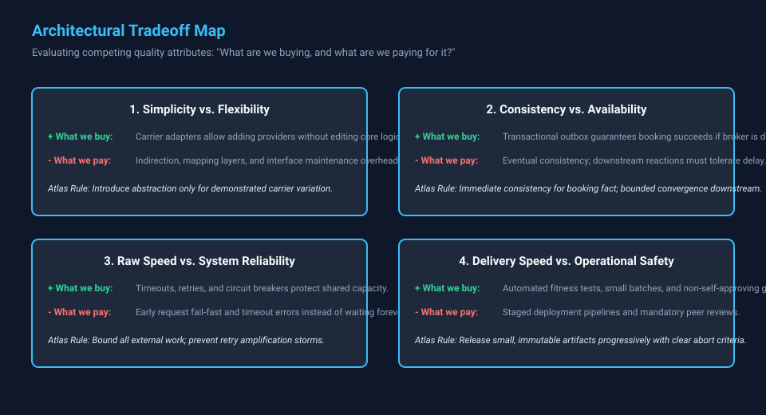

# Chapter 5 — Architectural Tradeoffs

## Evaluating Options, Sacrifices, and Reversibility

**Estimated listening time:** 20–24 minutes  
**Primary evidence label:** Teaching example  
**Teaching-chapter status:** Draft  
**Reference implementation:** Atlas Enterprise Platform

## What You Will Learn

By the end of this chapter, you should be able to:

- Explain why architecture is a discipline of deliberate tradeoffs rather than discovering universal designs.
- Frame architectural choices around the question: "What are we buying, and what are we paying for it?"
- Evaluate the cost of abstraction versus concrete simplicity.
- Balance immediate consistency against system availability using eventual consistency and transactional outboxes.
- Protect shared capacity by bounding deadlines, concurrency, and retries.
- Distinguish code duplication from knowledge duplication to avoid accidental coupling.
- Make architectural choices visible, deliberate, and reversible where practical.

## Evidence Guide

This chapter establishes general architectural reasoning applied across Atlas.

- **Implemented** — Behavior demonstrable in the Atlas reference implementation.
- **Current architecture** — A description linked to an authoritative current-state artifact.
- **Planned direction** — An intended change whose completion criteria or trigger is stated.
- **Teaching example** — A concrete scenario used to explain a design decision.
- **Conceptual extension** — A possible evolution used to explore a tradeoff, not a committed roadmap item.

---

## Narration

## 5.1 Simplicity Versus Flexibility

Software tends to begin concrete.

A service calls another service. A class creates an object. An application reads from a database. Authentication uses one provider. Messages travel through one broker.

Then requirements begin to accumulate.

Perhaps authentication must support OAuth in addition to API keys. Another carrier must be added. A second cloud environment appears. A different persistence implementation becomes necessary for testing. One integration needs different retry behavior from another.

The natural architectural response is abstraction.

Instead of:

```text
Application → FedEx
```

we introduce:

```text
Application
     ↓
Carrier Interface
     ↓
┌─────────┬─────────┬─────────┐
│ FedEx   │ UPS     │ USPS    │
└─────────┴─────────┴─────────┘
```

The system has become more flexible.

It has also become more complicated.

That second consequence is sometimes overlooked.

### Abstraction Has a Cost

An interface is not free merely because it contains only a few lines of code.

Consider a simple interface:

```java
public interface CarrierAdapter {
    RateResponse getRates(RateRequest request);
}
```

The code itself is trivial.

But the architectural consequences are not.

Someone reading the system now needs to understand:

- why the interface exists,
- which implementations exist,
- how an implementation is selected,
- how dependencies are injected,
- whether implementations behave equivalently,
- where provider-specific behavior belongs,
- what happens when a new provider requires capabilities the interface does not expose.

The abstraction has created flexibility, but it has also created a new concept that every future developer must understand.

That is the real cost of abstraction.

### The Wrong Question

Developers sometimes ask:

> “Could this change someday?”

Almost anything could change someday.

The more useful question is:

> **“What evidence do we have that this boundary represents genuine variation?”**

Atlas uses abstractions heavily around external systems because those boundaries have strong reasons to vary.

Carrier integrations are a good example.

FedEx, UPS, and USPS all perform conceptually similar operations, but their authentication mechanisms, APIs, terminology, capabilities, error behavior, and rate limits differ.

The variation is real.

An adapter boundary therefore buys something valuable.

By contrast, creating an abstraction around every internal class merely because an implementation *might* change usually creates ceremony rather than flexibility.

### The Rule of Three — With Context

A common heuristic says that duplication should be tolerated until the third occurrence before extracting an abstraction.

The idea is useful, but it should not be treated mechanically.

Sometimes the architectural boundary is already obvious.

If Atlas communicates with an external carrier API, an adapter is justified even if only one carrier currently exists because the boundary protects the domain from an external model.

Conversely, three classes containing similar-looking code do not necessarily represent the same abstraction.

Similarity is not enough.

The important question is whether they change for the same reasons.

This distinction is central to good architecture.

---

## 5.2 Consistency Versus Availability

Distributed systems introduce a problem that does not exist in quite the same form inside a single process.

Two parts of the system may disagree about reality.

Suppose Atlas accepts a shipment request and publishes an event:

```text
Create Shipment
      ↓
Atlas Database
      ↓
ShipmentCreated
      ↓
Message Broker
      ↓
Downstream Services
```

What happens if the database transaction succeeds but publishing the message fails?

The database believes the shipment exists.

The downstream system never hears about it.

We now have inconsistent state.

A tempting solution is to make everything participate in one transaction.

In practice, transactions spanning databases, message brokers, external APIs, and cloud services are often expensive, fragile, unavailable, or undesirable.

Atlas therefore uses patterns such as the **transactional outbox**.

```text
Database Transaction
       │
       ├── Shipment
       │
       └── Outbox Message
               ↓
          Commit Together
               ↓
        Background Publisher
               ↓
          Message Broker
```

The shipment and the intention to publish the event become durable together.

Publishing can occur afterward.

This changes the consistency model.

Instead of demanding:

> Everything is immediately consistent.

the architecture says:

> Everything will converge toward a consistent state.

That is **eventual consistency**.

### Eventual Does Not Mean Unreliable

The word *eventual* sometimes sounds like a concession.

It is actually a deliberate reliability strategy.

Suppose the message broker is unavailable for thirty seconds.

With tightly coupled synchronous processing, the entire business operation might fail.

With an outbox:

```text
Business transaction succeeds
           ↓
Event waits durably
           ↓
Broker recovers
           ↓
Publisher retries
           ↓
System converges
```

Atlas has traded immediate consistency for availability and recoverability.

That is often an excellent trade.

But it creates another obligation.

The system must tolerate temporary disagreement.

That affects user interfaces, reporting, workflows, monitoring, reconciliation, and operational procedures.

Eventual consistency is therefore not merely a messaging implementation detail.

It is a **business behavior**.

---

## 5.3 Performance Versus Reliability

Imagine an external carrier API occasionally responds slowly.

Atlas could wait indefinitely.

That maximizes the chance that an individual request eventually succeeds.

It also creates a serious system-level problem.

Threads, connections, memory, and request slots remain occupied.

Eventually:

```text
Slow dependency
      ↓
Requests accumulate
      ↓
Resources become exhausted
      ↓
Atlas becomes slow
      ↓
More requests accumulate
      ↓
System failure
```

One unreliable dependency has now propagated failure through the system.

Resilience mechanisms deliberately interrupt this chain.

Atlas can employ:

```text
Timeout
   ↓
Retry with Backoff
   ↓
Circuit Breaker
   ↓
Fallback / Failure
```

Each mechanism represents a tradeoff.

### Timeout

A timeout deliberately gives up on work that might eventually succeed.

That sounds undesirable until the alternative is resource exhaustion.

### Retry

Retries increase the probability of success for transient failures.

They also increase traffic against a system that may already be struggling.

### Backoff

Backoff reduces retry pressure.

It also increases latency.

### Circuit breaker

A circuit breaker temporarily refuses operations that might succeed.

It protects the larger system from repeatedly spending resources on a dependency that is probably unhealthy.

These mechanisms illustrate an important architectural principle:

> **Reliability is not the same thing as maximizing the success probability of every individual request.**

Sometimes the reliable action is to fail quickly.

The goal is not:

```text
Never fail a request
```

It is:

```text
Keep the system healthy enough to continue processing requests.
```

That distinction becomes increasingly important as systems become distributed.

---

## 5.4 Delivery Speed Versus Operational Safety

Modern development practices make software remarkably easy to deploy.

A developer pushes code.

CI runs.

A container image is built.

Infrastructure deploys it.

Traffic reaches the new version.

That might happen within minutes.

Technically, this is impressive.

Operationally, it can be terrifying.

Deployment speed and delivery safety are related, but they are not the same thing.

Atlas therefore treats the deployment pipeline as part of the architecture.

```text
Source
  ↓
Build
  ↓
Unit Tests
  ↓
Integration Tests
  ↓
Security / Quality Checks
  ↓
Container Image
  ↓
Deployment
  ↓
Health Verification
  ↓
Traffic
```

Every additional gate slows delivery.

Every removed gate increases risk.

The correct architecture depends on the consequences of failure.

A personal note-taking application and a financial settlement platform should not necessarily use identical deployment controls.

### Small Changes Reduce Risk

One of the strongest ways to reconcile speed and safety is surprisingly simple:

**make smaller changes.**

Compare:

```text
3-month release
      ↓
Hundreds of changes
      ↓
Large deployment
      ↓
Failure
      ↓
Which change caused it?
```

with:

```text
Small change
    ↓
Test
    ↓
Deploy
    ↓
Observe
```

Small deployments reduce the number of unknowns introduced simultaneously.

This makes rollback easier, diagnosis easier, testing more focused, and failures easier to understand.

Continuous delivery therefore does not merely optimize speed.

Done correctly, it can improve safety.

---

## 5.5 Duplication Versus Coupling

Software engineering correctly teaches developers to avoid unnecessary duplication.

But eliminating duplication can itself create architectural problems.

Imagine two Atlas services contain similar validation logic.

The immediate temptation is:

```text
Service A ──┐
            ├── Shared Validation Library
Service B ──┘
```

The duplicate code disappears.

But the services are now coupled through a shared dependency.

If their business rules later diverge, the supposedly helpful abstraction may become an obstacle.

This creates an important distinction:

> **Code duplication and knowledge duplication are not the same thing.**

Two pieces of code can look identical today while representing different business concepts.

If those concepts can evolve independently, combining them may be worse than duplicating several lines of code.

Shared libraries are most valuable when they represent genuinely shared technical capabilities:

```text
Logging
Telemetry
Authentication primitives
Serialization
Common protocol contracts
```

They deserve greater scrutiny when they contain business behavior.

A microservice architecture with dozens of services depending on one enormous internal library can quietly become a distributed monolith.

The network boundaries remain.

The independence does not.

---

## 5.6 Synchronous Versus Asynchronous Communication

A synchronous call is wonderfully simple.

```text
Service A → Service B → Response
```

The caller immediately knows whether the operation succeeded.

This makes synchronous communication appropriate for many queries and interactive operations.

But it also couples availability.

If Service B is unavailable, Service A may become unavailable.

Messaging changes the relationship.

```text
Service A
   ↓
Message Broker
   ↓
Service B
```

Service A may continue even while Service B is temporarily unavailable.

The price is complexity.

Now Atlas must consider:

- duplicate messages,
- message ordering,
- retries,
- dead-letter queues,
- idempotency,
- schema evolution,
- delayed processing,
- observability,
- poison messages,
- replay.

Asynchronous architecture therefore should not be adopted simply because it is considered more scalable or modern.

It should solve an actual problem.

A useful guideline is:

**Use synchronous communication when the caller needs an immediate answer. Use asynchronous communication when temporal decoupling provides meaningful value.**

Many enterprise systems appropriately use both.

---

## 5.7 Build Versus Buy

Every capability Atlas implements internally becomes something the organization owns.

Ownership includes much more than writing the first version.

It includes:

```text
Development
     +
Testing
     +
Documentation
     +
Security
     +
Deployment
     +
Monitoring
     +
Upgrades
     +
Incident Response
     +
Future Maintenance
```

This makes apparently expensive managed services surprisingly economical in some situations.

Conversely, buying a service introduces its own costs:

- vendor dependency,
- recurring fees,
- integration constraints,
- limited customization,
- migration difficulty,
- data residency considerations,
- pricing uncertainty.

There is no universal answer.

The architectural question is:

> **Is this capability strategically important enough that owning it creates meaningful value?**

Authentication infrastructure provides a useful example.

An organization *can* build an identity platform.

But unless identity itself differentiates the business, using a mature identity provider often transfers enormous security and maintenance responsibility to an organization specializing in exactly that problem.

Architecture includes knowing what **not** to build.

---

## 5.8 Portability Versus Cloud-Native Capability

Atlas can be designed to minimize dependency on a particular cloud provider.

For example:

```text
Application
     ↓
Generic Queue Abstraction
     ↓
AWS / Azure / GCP
```

This improves portability.

But abstraction can hide useful capabilities.

Azure Service Bus, AWS SQS/SNS, and Google Cloud Pub/Sub overlap conceptually, but they are not identical products.

Trying to expose only their common denominator may prevent Atlas from taking advantage of capabilities that make one platform particularly effective.

This produces another recurring tradeoff:

```text
Portability
    ↑
    │
 abstraction
    │
    ↓
Platform optimization
```

The appropriate balance depends on whether cloud portability is an actual business requirement.

Avoiding every provider-specific feature because the system *might someday migrate clouds* can impose years of additional complexity to protect against a migration that never occurs.

At the same time, embedding provider SDK calls throughout business logic creates unnecessary lock-in.

Atlas therefore favors **architectural boundaries around infrastructure**, without pretending every infrastructure provider is identical.

That gives the system room to evolve without forcing it into a fictional lowest-common-denominator platform.

---

## 5.9 The Architecture Decision Record

Tradeoffs become dangerous when their reasoning disappears.

Six months after a decision, someone may encounter an apparently unnecessary abstraction and remove it.

Or they may discover an awkward implementation and conclude that its original author simply made a poor choice.

Often there was a reason.

The context has simply been lost.

This is why Atlas uses **Architecture Decision Records (ADRs).**

A useful ADR can be remarkably small:

```text
Title
Context
Decision
Alternatives
Consequences
Status
```

The most important section may be **Consequences**.

Every meaningful architectural decision should have them.

For example:

```text
Decision:
Use transactional outbox for integration events.

Benefits:
- Database change and event intent are atomic.
- Broker outages do not lose committed events.
- Publishing can retry independently.

Costs:
- Events are eventually consistent.
- Additional outbox storage is required.
- A publisher process must be operated.
- Duplicate delivery remains possible.
- Consumers must be idempotent.
```

That is architecture expressed honestly.

The ADR does not claim the solution is perfect.

It explains why its advantages were worth its costs.

---

## 5.10 Architecture as the Management of Constraints

This brings us to a broader definition of architecture.

Architecture is often represented visually:

```text
┌────────────┐
│ Front End  │
└─────┬──────┘
      ↓
┌────────────┐
│    API     │
└─────┬──────┘
      ↓
┌────────────┐
│  Services  │
└─────┬──────┘
      ↓
┌────────────┐
│ Database   │
└────────────┘
```

That diagram describes structure.

Architecture is more than structure.

Architecture includes the reasons that structure exists.

Why is this boundary here?

Why is this operation asynchronous?

Why is this data duplicated?

Why does this service own this database?

Why do retries stop after a certain point?

Why did we choose a managed service?

Why did we deliberately *not* create an abstraction?

Those questions reveal the architecture.

The boxes merely show where it ended up.

---

## 5.11 The Senior Engineer's Question

A less experienced engineer may encounter a design and ask:

> “Is this the best architecture?”

A more useful question is:

> **“Best for what?”**

Best for performance?

Best for developer productivity?

Best for reliability?

Best for cost?

Best for portability?

Best for a team of five?

Best for a team of five hundred?

Best for getting a product into production next month?

Best for operating that product for twenty years?

These objectives frequently conflict.

Architecture exists precisely because they conflict.

The role of the architect or senior engineer is not to eliminate tradeoffs.

That is impossible.

The role is to **make the important tradeoffs visible, deliberate, and reversible where practical.**

Atlas will continue to evolve.

Technologies will change.

Cloud platforms will change.

Frameworks will change.

Some assumptions in this book will eventually become obsolete.

But the reasoning process survives those changes.

When faced with a new technology, the useful questions remain remarkably stable:

**What problem does this solve?**

**What complexity does it introduce?**

**What failure modes does it create?**

**What operational responsibility does it add?**

**What alternatives are we rejecting?**

**How difficult will this decision be to reverse?**

And perhaps most importantly:

> **What are we buying, and what are we paying for it?**

That is the discipline behind architectural tradeoffs—and one of the foundations of engineering mature systems.



*(Hands-on Practice: [Exercise 5 — Make the Tradeoff](../exercises/exercise-05-make-the-tradeoff.md))*

### What's Next?

Understanding tradeoffs between consistency, availability, and simplicity leads directly to the ultimate stress test of any design: how the system behaves when components, networks, and providers inevitably fail.

In **Chapter 6 — Failure Is Part of the Architecture**, we move from theoretical tradeoffs to operational reality, exploring fault containment, retry budgets, circuit breakers, and building systems that degrade gracefully without cascading collapse.
