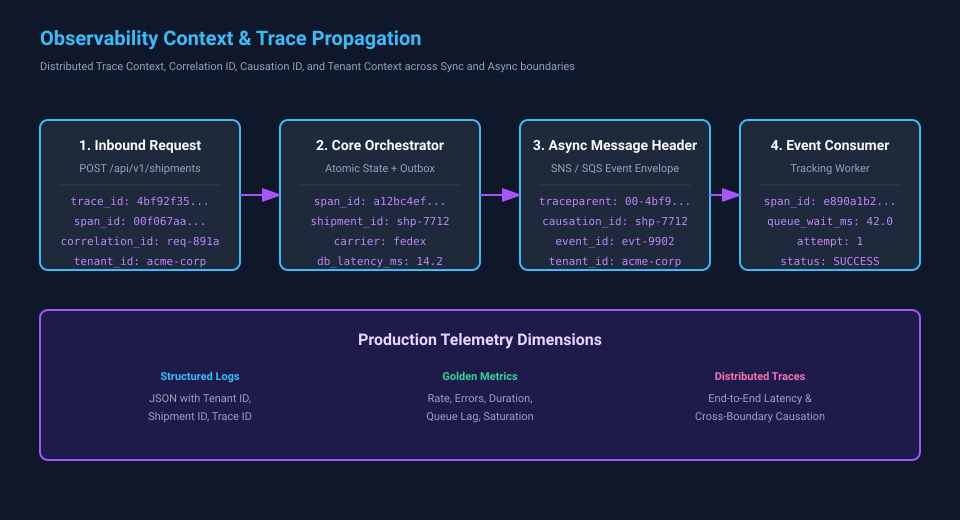

# Chapter 7 — Observability: Understanding a Running System

## Making Atlas Explain Its Behavior

**Estimated listening time:** 24–28 minutes  
**Primary evidence label:** Teaching example  
**Teaching-chapter status:** Draft  
**Reference implementation:** Atlas Enterprise Platform

## What You Will Learn

By the end of this chapter, you should be able to:

- Explain why observability begins with operational questions rather than logging tools.
- Distinguish structured logs, metrics, traces, and business telemetry by the questions they answer.
- Propagate correlation, causation, tenant, and shipment context across synchronous and asynchronous paths.
- Define meaningful Service Level Indicators (SLIs) and Service Level Objectives (SLOs) that reflect actual business health.
- Use golden signals, RED, and USE methods to detect and diagnose degradation before catastrophic outage.
- Design alert policies and runbooks that give operators actionable evidence during production incidents.

## Evidence Guide

This chapter examines telemetry, diagnostic context, and operational interfaces in Atlas.

- **Implemented** — Behavior demonstrable in the Atlas reference implementation.
- **Current architecture** — A description linked to an authoritative current-state artifact.
- **Planned direction** — An intended change whose completion criteria or trigger is stated.
- **Teaching example** — A concrete scenario used to explain a design decision.
- **Conceptual extension** — A possible evolution used to explore a tradeoff, not a committed roadmap item.

---

## Narration

For Atlas, those signals primarily include:

```text
Logs
Metrics
Traces
Events
Health signals
Business telemetry
```

Together, they allow engineers to move from:

```text
Something is wrong.
```

to:

```text
This request spent 4.2 seconds waiting on the carrier API,
retried twice after HTTP 503 responses,
and succeeded on the third attempt.
The problem began after 14:05 UTC and affects only Carrier X.
```

That difference is operational maturity.

---

## 7.1 Monitoring and Observability Are Related but Different

Monitoring asks known questions.

For example:

```text
Is CPU usage above 80%?

Is the API returning too many 500 responses?

Is queue depth above 10,000?

Is the database reachable?
```

These are valuable questions.

They represent conditions we already know might matter.

Observability must also help answer questions we did not anticipate when the system was designed.

Suppose a customer reports that shipment creation is slow only when:

```text
Tenant = A
Carrier = B
Region = C
Authentication type = OAuth
```

Nobody may have created a dashboard specifically for that combination.

A sufficiently observable system still gives engineers enough structured information to investigate it.

This distinction can be summarized as:

```text
Monitoring
    ↓
Answers predefined questions

Observability
    ↓
Provides evidence for investigating
questions we did not know to ask
```

Monitoring is part of observability.

It is not the whole of it.

---

## 7.2 The Three Traditional Pillars

Observability discussions commonly begin with three telemetry types:

```text
Logs
Metrics
Traces
```

Each answers different questions.

### Logs

Logs describe discrete events.

```text
2026-09-01T14:03:27Z
Shipment creation failed
carrier=FedEx
status=503
attempt=2
```

Logs are rich in context.

They are especially useful for understanding individual events and failures.

### Metrics

Metrics summarize behavior numerically.

```text
atlas_requests_total = 18,421,392

atlas_request_duration_p95 = 420 ms

carrier_errors_total = 184

queue_depth = 2,341
```

Metrics are efficient for trends, dashboards, thresholds, and alerting.

### Traces

Traces follow work across boundaries.

```text
Browser
   ↓
Atlas API
   ↓
Shipment Service
   ↓
Carrier Adapter
   ↓
Carrier API
```

A trace can show how much time was spent at each step.

The three complement one another:

```text
Metric:
Something is getting slower.

Trace:
The carrier call is responsible.

Log:
The carrier returned 503 twice
before the request succeeded.
```

No single telemetry type replaces the others.

---

## 7.3 Structured Logging

A traditional log message might look like:

```text
Failed to create shipment for tenant 42 using FedEx after 3 attempts.
```

A human can read it.

A machine has to parse it.

Structured logging represents the same information as fields:

```json
{
  "event": "shipment_creation_failed",
  "tenant_id": "42",
  "carrier": "fedex",
  "attempts": 3,
  "correlation_id": "f87c...",
  "duration_ms": 4217
}
```

Now the logging platform can answer questions such as:

```text
Show shipment failures
where carrier = fedex
and attempts >= 3
during the last hour.
```

This is much more useful than searching arbitrary strings.

Atlas therefore treats logs as structured data rather than decorated console output.

---

## 7.4 Log Events, Not Sentences

A useful way to think about logging is:

> **A log entry represents an event that happened in the system.**

For example:

```text
shipment_requested
shipment_created
carrier_request_started
carrier_request_failed
carrier_request_retried
message_dead_lettered
circuit_breaker_opened
authentication_failed
```

Each event can carry dimensions describing its context.

```text
event = carrier_request_failed
carrier = ups
operation = create_shipment
tenant = 42
status_code = 503
attempt = 2
duration_ms = 1803
```

The textual message remains useful for humans, but the fields make the event computationally useful.

This becomes increasingly important as Atlas scales.

Reading logs one line at a time is reasonable when there are hundreds.

It is not reasonable when there are billions.

---

## 7.5 Log Levels Need Discipline

Most logging frameworks provide levels such as:

```text
TRACE
DEBUG
INFO
WARN
ERROR
CRITICAL
```

Without conventions, teams use these inconsistently.

One service logs every retry as an error.

Another logs the same condition as debug information.

A third does not log it at all.

Atlas benefits from a shared interpretation.

For example:

### TRACE

Very detailed diagnostic information normally disabled in production.

### DEBUG

Information useful during troubleshooting but too verbose for routine operational use.

### INFO

Expected significant events in normal system behavior.

### WARN

An unusual condition occurred, but Atlas handled it successfully.

### ERROR

An operation failed and requires attention or resulted in an unsuccessful outcome.

### CRITICAL

A severe condition threatens continued operation or causes broad loss of service.

The exact definitions matter less than consistency.

If every transient retry produces an ERROR entry even though retries normally succeed, operators eventually learn to ignore errors.

That is dangerous.

Telemetry should preserve meaning.

---

## 7.6 Correlation IDs Connect the Story

Consider a request moving through several services:

```text
Client
  ↓
API Gateway
  ↓
Atlas API
  ↓
Shipment Service
  ↓
Carrier Adapter
```

Each component may produce logs.

Without correlation:

```text
Log A
Log B
Log C
Log D
```

Engineers have to infer which entries belong together.

A correlation or trace identifier connects them:

```text
trace_id = abc123
```

Now:

```text
API Gateway       trace_id=abc123
Atlas API         trace_id=abc123
Shipment Service  trace_id=abc123
Carrier Adapter   trace_id=abc123
```

The distributed operation becomes one searchable story.

This is particularly important for asynchronous systems.

A request may produce an event that is processed minutes later.

The processing context should preserve enough identifiers to connect the later work with the original business operation.

---

## 7.7 Distributed Tracing

Distributed tracing formalizes this idea.

A **trace** represents an end-to-end operation.

A **span** represents one piece of that operation.

For example:

```text
Trace: Create Shipment
│
├── Span: HTTP POST /shipments
│
├── Span: Validate request
│
├── Span: Save shipment
│
├── Span: Publish event
│
└── Span: Carrier request
```

Each span can record:

```text
start time
duration
status
attributes
parent span
events
errors
```

The resulting timeline might reveal:

```text
POST /shipments                 4.8 s
│
├── validation                  12 ms
├── database                    41 ms
├── carrier authentication      23 ms
└── carrier API                4.7 s
```

The bottleneck becomes obvious.

Without tracing, the application merely appears slow.

---

## 7.8 Trace Context Across Messaging

Tracing synchronous HTTP calls is relatively straightforward.

Messaging complicates the picture.

Consider:

```text
Request
   ↓
Atlas API
   ↓
Message Broker
   ↓
Worker
   ↓
Carrier
```

The worker may run:

- on another machine,
- in another process,
- several seconds later,
- after a retry,
- after the original HTTP request has completed.

Trace context must therefore travel with the message.

Conceptually:

```json
{
  "message_id": "m-123",
  "trace_id": "t-456",
  "correlation_id": "c-789",
  "payload": {
    "...": "..."
  }
}
```

The consumer creates its processing span using the propagated context.

This allows observability tools to connect asynchronous work into a larger causal chain.

---

## 7.9 Metrics Describe System Behavior

Logs answer detailed questions about individual events.

Metrics answer aggregate questions.

Useful Atlas metrics might include:

```text
HTTP requests per second
HTTP error rate
request latency
active requests
database query latency
connection pool utilization
queue depth
consumer lag
messages processed per second
retry rate
timeout rate
circuit breaker state
carrier response latency
authentication failures
```

Metrics are particularly valuable because they can be aggregated efficiently over long periods.

A dashboard can quickly show:

```text
Last 24 hours

Requests       12.4M
Success rate   99.94%
p50 latency    110 ms
p95 latency    420 ms
p99 latency    1.8 s
```

That gives operators an immediate view of system health.

---

## 7.10 Averages Hide Problems

Suppose Atlas reports:

```text
Average latency = 200 ms
```

That sounds good.

But the underlying distribution might be:

```text
90 requests → 100 ms
9 requests  → 500 ms
1 request   → 8 seconds
```

The average hides the customer experiencing eight-second latency.

Latency is therefore commonly described using percentiles.

```text
p50 = 50% of requests are this fast or faster
p95 = 95% are this fast or faster
p99 = 99% are this fast or faster
```

For example:

```text
p50 = 120 ms
p95 = 480 ms
p99 = 2.1 s
```

This tells a much richer story.

The tail matters because users frequently experience the slowest parts of distributed systems.

One page may require several backend calls.

Even if each call is usually fast, the probability that at least one call lands in the slow tail increases as the number of dependencies grows.

---

## 7.11 The Four Golden Signals

A useful operational model comes from site reliability engineering.

For many services, four signals provide an excellent starting point:

```text
Latency
Traffic
Errors
Saturation
```

### Latency

How long does work take?

### Traffic

How much work is arriving?

### Errors

How much work is failing?

### Saturation

How close is the system to its capacity limits?

Atlas can apply these questions to almost every major component.

For an API:

```text
Latency    → request duration
Traffic    → requests/sec
Errors     → failed requests
Saturation → workers/connections/CPU
```

For a queue consumer:

```text
Latency    → processing duration
Traffic    → messages/sec
Errors     → failed messages
Saturation → backlog / consumer capacity
```

For a carrier:

```text
Latency    → provider response time
Traffic    → outbound requests/sec
Errors     → provider failures
Saturation → rate-limit or concurrency usage
```

This creates a consistent way of reasoning across the platform.

---

## 7.12 RED and USE

Two related models are also useful.

For request-oriented services, **RED** focuses on:

```text
Rate
Errors
Duration
```

For infrastructure resources, **USE** focuses on:

```text
Utilization
Saturation
Errors
```

For example, a database connection pool might be examined through USE:

```text
Utilization:
How many connections are active?

Saturation:
How many requests are waiting for a connection?

Errors:
How many connection attempts fail?
```

These frameworks are not laws.

They are checklists that reduce the chance that teams monitor only the easiest metric, such as CPU usage, while missing the signal that actually affects users.

---

## 7.13 Technical Metrics Are Not Enough

Atlas could have perfect infrastructure metrics while failing the business.

Suppose:

```text
CPU             25%
Memory          40%
HTTP errors     0.01%
Database        healthy
Queue depth     low
```

Everything looks excellent.

But perhaps:

```text
80% of shipment purchases are being rejected
because a pricing rule is incorrect.
```

Infrastructure telemetry may not detect that.

Atlas therefore also needs **business telemetry**.

Examples might include:

```text
shipments_created
shipments_cancelled
rate_quotes_returned
carrier_selection_rate
integration_sync_success
integration_sync_failure
orders_processed
authentication_success
authentication_failure
```

Business telemetry answers:

> **Is the system accomplishing what it exists to accomplish?**

This is often the most important form of monitoring.

---

## 7.14 High Cardinality

Telemetry dimensions are powerful.

They can also become expensive.

Suppose Atlas records a metric:

```text
request_count
```

with:

```text
carrier = fedex | ups | usps
```

That has low cardinality.

There are only a few possible values.

Now imagine adding:

```text
request_id
```

Every request has a unique value.

Millions of requests produce millions of metric series.

This is **high cardinality**.

Metrics systems generally perform best when dimensions have bounded sets of values.

Useful metric dimensions might include:

```text
service
operation
status
carrier
region
environment
```

Unique identifiers generally belong in logs and traces instead:

```text
request_id
message_id
shipment_id
user_id
trace_id
```

Choosing the correct telemetry type is therefore partly a data-modeling problem.

---

## 7.15 Observability Has a Cost

Telemetry is not free.

Every signal consumes some combination of:

```text
CPU
network bandwidth
storage
indexing capacity
retention cost
query cost
engineering attention
```

A large platform can generate enormous amounts of telemetry.

If Atlas records a detailed trace for every request indefinitely, observability costs may rival application infrastructure costs.

This creates another architectural tradeoff.

Useful strategies include:

```text
sampling
retention tiers
aggregation
log-level controls
metric cardinality limits
trace filtering
```

For example:

```text
100% of errors traced
100% of unusually slow requests traced
5% of normal requests traced
```

The exact strategy depends on workload and operational requirements.

The goal is not maximum telemetry.

It is **sufficient evidence to understand the system economically**.

---

## 7.16 Sampling

Suppose Atlas handles:

```text
100,000 requests/second
```

Capturing a detailed trace for every request may be unnecessary.

Head-based sampling decides near the beginning of a trace:

```text
Trace starts
   ↓
Sample?
   │
 ┌─┴─┐
Yes  No
```

Tail-based sampling can decide after observing the trace:

```text
Trace completes
      ↓
Was it slow?
Did it fail?
Was it unusual?
      ↓
Keep or discard
```

Tail sampling is operationally powerful because rare failures and slow requests can be retained even when most normal traffic is discarded.

Again, the architecture is balancing diagnostic value against cost.

---

## 7.17 Dashboards Should Answer Questions

A dashboard filled with graphs is not automatically useful.

Every dashboard should answer a question.

For example:

### Is Atlas healthy?

```text
Availability
Error rate
p95/p99 latency
traffic
saturation
```

### Are integrations healthy?

```text
Success rate by provider
latency by provider
retry rate
timeout rate
circuit state
rate-limit events
```

### Is messaging healthy?

```text
queue depth
oldest message age
consumer throughput
consumer lag
dead-letter count
processing failures
```

### Is a deployment healthy?

```text
error rate before/after deployment
latency before/after deployment
instance health
new exception types
business transaction success
```

The best dashboard is not the one containing the most telemetry.

It is the one that lets an operator answer the relevant question quickly.

---

## 7.18 Alert on Symptoms, Not Every Event

One failed request does not necessarily require waking an engineer.

One retry certainly should not.

Distributed systems experience transient failures routinely.

Alerting on every low-level error creates noise.

Noise creates alert fatigue.

Alert fatigue creates ignored alerts.

A better approach is to alert primarily on meaningful symptoms.

Instead of:

```text
Alert:
One carrier request failed.
```

consider:

```text
Alert:
Carrier request failure rate > 10%
for 10 minutes.
```

Or even better:

```text
Alert:
Shipment creation success rate
has fallen below the SLO.
```

The closer an alert is to user impact, the more actionable it tends to be.

Diagnostic metrics can then help determine the cause.

---

## 7.19 Alerts Must Be Actionable

Every production alert should imply a reasonable human action.

An engineer receiving an alert should be able to ask:

```text
What happened?

What is affected?

How severe is it?

Where should I investigate?

What can I do?
```

A useful alert might include:

```text
Service: shipment-service
Environment: production
Condition: p99 latency > 5 seconds
Duration: 15 minutes
Affected carrier: UPS
Runbook: shipment-latency
Dashboard: carrier-performance
Recent deployment: 2026.09.01.4
```

Compare that with:

```text
ALERT: LATENCY HIGH
```

Both may be technically correct.

Only one accelerates incident response.

---

## 7.20 Service-Level Indicators

A **Service-Level Indicator (SLI)** measures something users care about.

For example:

```text
successful shipment requests
----------------------------
total shipment requests
```

might represent availability.

Another SLI could measure latency:

```text
percentage of shipment requests
completed within 1 second
```

SLIs transform vague concepts such as "reliable" into measurable behavior.

---

## 7.21 Service-Level Objectives

A **Service-Level Objective (SLO)** establishes a target for an SLI.

For example:

```text
99.9% of valid shipment requests
will complete successfully
over a rolling 30-day window.
```

Or:

```text
99% of rate requests
will complete within 1 second.
```

An SLO gives engineering and the business a shared definition of acceptable reliability.

Without one, conversations often become:

```text
"The system needs to be more reliable."
```

How reliable?

Under what workload?

Measured over what period?

For which operation?

SLOs force those questions to become explicit.

---

## 7.22 Error Budgets

If an SLO allows less than perfect reliability, the remaining amount is the **error budget**.

Suppose the SLO is:

```text
99.9% availability
```

Then approximately:

```text
0.1%
```

of requests may fail while the service still meets its objective.

This is not permission to create failures carelessly.

It is recognition that engineering has competing goals.

Teams need both:

```text
Reliability
and
Delivery velocity
```

If the service is comfortably within its error budget, the organization may accept more deployment risk.

If the budget is exhausted, reliability work may take priority over feature delivery.

This turns reliability into a measurable engineering constraint rather than an abstract aspiration.

---

## 7.23 Observability Across Tenants

Atlas is a multi-tenant platform.

That creates additional questions.

A global metric might show:

```text
Overall success rate = 99.95%
```

That looks excellent.

But perhaps:

```text
Tenant A = 99.99%
Tenant B = 99.99%
Tenant C = 82.00%
```

The aggregate hides a severe tenant-specific problem.

Telemetry therefore needs enough tenant context to identify localized failures.

At the same time, tenant identifiers can create:

- cardinality concerns,
- privacy concerns,
- security concerns,
- cost concerns.

Atlas must deliberately decide where tenant dimensions belong.

For example:

```text
Metrics:
tenant tier or bounded grouping

Logs:
tenant identifier where appropriate

Traces:
tenant context with access controls
```

The exact design depends on scale and privacy requirements.

---

## 7.24 Sensitive Data Does Not Belong in Telemetry

Logs are frequently copied into centralized systems.

They may have long retention periods.

Many engineers may have access to them.

That makes careless logging dangerous.

Atlas should avoid recording:

```text
passwords
access tokens
refresh tokens
API secrets
private keys
full payment information
sensitive personal data
```

Even apparently harmless request or response logging can expose credentials.

For example:

```text
Authorization: Bearer eyJ...
```

should never appear in ordinary logs.

Observability must therefore be designed alongside security.

A useful principle is:

> **Telemetry is production data and should be governed accordingly.**

---

## 7.25 OpenTelemetry and Vendor Neutrality

Atlas may run on:

```text
Azure
AWS
GCP
local development
Kubernetes
```

Each environment has its own observability products.

Directly embedding every vendor's telemetry API throughout application code creates unnecessary coupling.

OpenTelemetry provides a standardized model for:

```text
traces
metrics
logs
context propagation
```

Conceptually:

```text
Atlas
   ↓
OpenTelemetry
   ↓
Collector
   ↓
┌────────┬────────┬─────────────┐
│ Azure  │ AWS    │ Other tools │
└────────┴────────┴─────────────┘
```

The application emits standardized telemetry.

Exporters and collectors determine where that telemetry goes.

This does not make every observability platform identical.

It creates a useful architectural boundary between application instrumentation and telemetry infrastructure.

---

## 7.26 Cloud Observability

Atlas can map the same observability concepts onto different cloud platforms.

Conceptually:

```text
                    Atlas
                      │
             OpenTelemetry
                      │
        ┌─────────────┼─────────────┐
        ↓             ↓             ↓
      Azure          AWS           GCP
```

Typical platform services may include:

```text
Azure
- Azure Monitor
- Application Insights
- Log Analytics

AWS
- CloudWatch
- X-Ray
- managed OpenTelemetry tooling

GCP
- Cloud Monitoring
- Cloud Logging
- Cloud Trace
```

The product names differ.

The architectural questions remain largely the same:

```text
Can we see failures?

Can we follow requests?

Can we measure latency?

Can we see queue backlog?

Can we identify dependency problems?

Can we correlate telemetry?

Can we alert on user impact?
```

This is an important recurring lesson in cloud architecture.

Products change faster than principles.

---

## 7.27 Observing Message Queues

Message-driven systems require signals beyond ordinary HTTP monitoring.

Atlas should understand at least:

```text
queue depth
message arrival rate
message processing rate
oldest message age
consumer count
consumer lag
processing duration
retry count
dead-letter count
```

Queue depth alone is insufficient.

Consider:

```text
Queue depth = 10,000
```

Is that bad?

Perhaps the system normally processes 50,000 messages per second.

The queue will disappear almost immediately.

Now consider:

```text
Queue depth = 500
Oldest message age = 4 hours
```

That is far more concerning.

Backlog should therefore be interpreted relative to throughput and age.

---

## 7.28 Observing Retries

Retries often make systems appear healthier than they are.

Suppose users see:

```text
99.99% successful requests
```

But telemetry shows:

```text
40% required at least one retry.
```

The dependency may be approaching failure even though the user-visible success rate remains high.

Useful retry telemetry includes:

```text
retry attempts by dependency
retry success rate
retry exhaustion
backoff duration
original failure reason
```

A sudden increase in retries is often an early-warning signal.

---

## 7.29 Observing Circuit Breakers

A circuit breaker is a state machine.

Its state should therefore be observable.

Useful events include:

```text
circuit_opened
circuit_half_open
circuit_closed
```

with dimensions such as:

```text
dependency
operation
reason
failure_rate
duration
```

A circuit opening may be entirely correct behavior.

But operators need to know that Atlas has intentionally stopped calling a dependency.

Otherwise a graceful resilience mechanism can look like mysterious application failure.

---

## 7.30 Observing Timeouts

Timeouts deserve their own telemetry.

A generic:

```text
request_failed
```

does not tell operators whether the cause was:

```text
validation
authentication
connection refusal
provider error
timeout
circuit breaker
rate limit
```

Atlas should distinguish these failure categories.

Timeout telemetry should ideally show:

```text
dependency
operation
configured timeout
elapsed duration
attempt number
```

This helps answer an important question:

> Is the dependency becoming slower, or is our timeout simply unrealistic?

---

## 7.31 Observing Rate Limits

Rate limiting creates intentional rejection or delay.

That behavior should be visible.

For inbound traffic:

```text
tenant
endpoint
requests rejected
limit
current rate
```

For outbound traffic:

```text
provider
configured limit
current utilization
throttled requests
provider 429 responses
```

This distinguishes:

```text
Atlas deliberately throttled traffic
```

from:

```text
The provider unexpectedly rejected traffic.
```

Those conditions may require very different responses.

---

## 7.32 Deployment Markers

One of the most useful pieces of operational context is remarkably simple:

```text
When did we deploy?
```

Imagine a graph:

```text
Error rate
   │
   │             █████
   │           ███████
   │         █████████
   │___________│____________
               ↑
            deploy
```

The relationship immediately suggests an investigation.

Atlas telemetry should therefore preserve deployment information such as:

```text
service version
build number
commit SHA
deployment timestamp
environment
```

This lets operators compare behavior across versions.

A production incident should not begin with:

> "Does anyone know what version is running?"

The system should know.

---

## 7.33 Observability During Incident Response

Good observability changes the incident workflow.

Without it:

```text
Customer reports issue
        ↓
Engineer checks logs
        ↓
Cannot find anything
        ↓
Try reproducing
        ↓
Restart something
        ↓
Wait
```

With mature telemetry:

```text
Alert detects SLO impact
        ↓
Dashboard identifies affected capability
        ↓
Trace identifies slow dependency
        ↓
Logs reveal 429 responses
        ↓
Metrics show outbound rate spike
        ↓
Deployment marker identifies recent change
        ↓
Mitigation
```

The goal is not to eliminate investigation.

It is to replace speculation with evidence.

---

## 7.34 Runbooks Turn Signals Into Action

An alert identifies a problem.

A runbook describes what to do next.

For example:

```text
Alert:
Carrier circuit breaker open

Runbook:
1. Check carrier health dashboard.
2. Check timeout and retry rates.
3. Confirm whether multiple tenants are affected.
4. Check provider status.
5. Verify outbound rate limits.
6. Determine whether fallback routing is available.
7. Escalate if outage exceeds threshold.
```

Runbooks capture operational knowledge that otherwise lives in individual engineers' memories.

They are especially valuable during stressful incidents when reasoning capacity is constrained.

Observability and operational documentation therefore reinforce one another.

---

## 7.35 Observability Is Part of the Interface

When engineers design a component, they usually think about its functional interface.

For example:

```java
RateResponse getRates(RateRequest request);
```

A production-ready component also has an operational interface.

It should communicate:

```text
How often am I called?

How long do I take?

How often do I fail?

Why do I fail?

What dependencies do I use?

Am I approaching capacity?

What version am I?

Which business operation am I performing?
```

This suggests a broader definition of a well-designed service.

It does not merely perform work.

It explains its behavior while performing that work.

---

## 7.36 Instrument the Boundaries

Not every line of code needs telemetry.

The most valuable instrumentation often occurs at architectural boundaries.

Examples include:

```text
HTTP request enters service
service calls database
service calls external API
message is published
message is consumed
authentication occurs
cache is accessed
circuit changes state
business transaction completes
```

These boundaries represent transitions where:

- latency accumulates,
- failures propagate,
- ownership changes,
- state changes,
- external dependencies become involved.

Instrumenting them creates a map of system behavior without drowning engineers in meaningless detail.

---

## 7.37 The Cost of Missing Context

Consider this log:

```text
Request failed.
```

It technically records a failure.

Operationally, it says almost nothing.

Compare:

```text
event=carrier_request_failed
service=shipment-service
version=2026.09.01.4
environment=production
carrier=ups
operation=create_shipment
tenant=tenant-42
status=503
attempt=3
duration_ms=4821
trace_id=abc123
```

The second entry is useful because it carries context.

This leads to a practical principle:

> **Telemetry without context produces data. Telemetry with context produces evidence.**

Atlas needs evidence.

---

## 7.38 The Senior Engineer's Questions

When reviewing a new service or integration, a senior engineer should ask more than:

> Does it work?

They should also ask:

```text
How will we know it is working?

How will we know it is getting slower?

How will we know it is failing?

Can we distinguish our failure
from a dependency failure?

Can we follow one request
across service boundaries?

Can we identify affected tenants?

Can we see retry amplification?

Can we see queue backlog?

Can we correlate behavior
with a deployment?

Will an alert tell someone
what action to take?
```

These questions change implementation decisions early enough that observability becomes part of the system rather than an emergency retrofit.

---

## 7.39 You Cannot Operate What You Cannot Understand

Atlas is not finished when it successfully processes requests.

A production system must also reveal what it is doing.

That requires deliberate instrumentation.

Logs provide detailed events.

Metrics reveal trends.

Traces connect distributed work.

Business telemetry measures outcomes.

SLOs define reliability.

Alerts identify meaningful degradation.

Runbooks connect signals to action.

Together they transform a distributed collection of processes into something engineers can reason about while it is running.

This gives us the central principle of this chapter:

> **A production system should be designed not only to perform its work, but to explain its behavior.**

Without that ability, engineers operate through inference and intuition.

With it, they operate through evidence.

And as Atlas grows across services, queues, databases, providers, containers, tenants, and clouds, that evidence becomes one of the most important architectural capabilities the platform possesses.



*(Related Decision: [ADR-0007 — OpenTelemetry Instrumentation and Context Propagation Boundary](../adr-examples/ADR-0007-opentelemetry-instrumentation-boundary.md) | Hands-on Practice: [Exercise 7 — Diagnose the Incident](../exercises/exercise-07-diagnose-the-incident.md))*

### What's Next?

With comprehensive observability and production feedback in place, we can confront the reality of long-lived enterprise software: systems cannot remain static. 

In **Chapter 8 — Evolutionary Architecture**, we explore how to guide architectural change safely over time using automated fitness functions, expand-and-contract migrations, strangler patterns, and Architecture Decision Records (ADRs).
