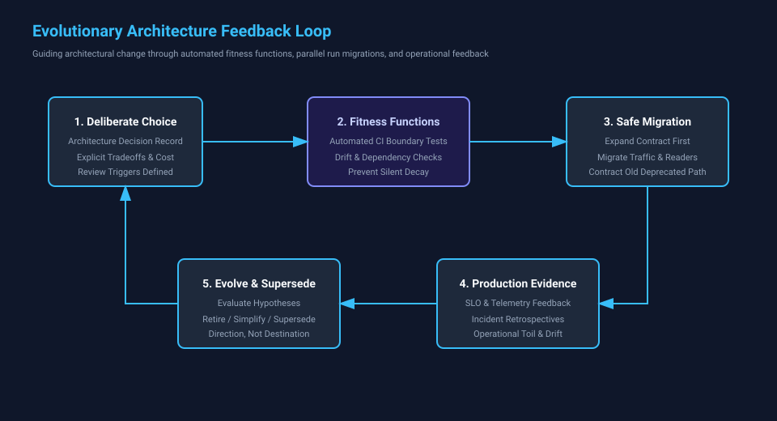

# Chapter 8 — Evolutionary Architecture

## Fitness Functions, Safe Evolution, and Architecture Ownership

**Estimated listening time:** 22–26 minutes  
**Primary evidence label:** Teaching example  
**Teaching-chapter status:** Ready  
**Reference implementation:** Atlas Enterprise Platform

## What You Will Learn

By the end of this chapter, you should be able to:

- Distinguish intended architecture from actual system decay and dependency drift.
- Implement automated architectural fitness functions using static analysis, dependency tests, and contract verification.
- Execute safe parallel migrations using the expand-and-contract and strangler application patterns.
- Manage backward and forward schema compatibility across APIs, events, and databases.
- Establish clear ownership boundaries for domains, services, contracts, operational health, and retirement.
- Document high-impact architectural decisions and review triggers using Architecture Decision Records (ADRs).

## Evidence Guide

This chapter examines evolutionary controls, fitness functions, and governance in Atlas.

- **Implemented** — Behavior demonstrable in the Atlas reference implementation.
- **Current architecture** — A description linked to an authoritative current-state artifact.
- **Planned direction** — An intended change whose completion criteria or trigger is stated.
- **Teaching example** — A concrete scenario used to explain a design decision.
- **Conceptual extension** — A possible evolution used to explore a tradeoff, not a committed roadmap item.

---

## Narration

That changes the architectural question from:

> **What should Atlas look like?**

to:

> **How can Atlas continue becoming what the business needs without gradually becoming unmanageable?**

That is the problem of evolutionary architecture.

---

## 8.1 Architecture Is a Living Constraint System

Architecture is sometimes treated as a collection of components.

```text
API
Services
Database
Message Broker
Cache
```

But the components themselves are not the most important part.

The relationships and constraints between them are.

For example:

```text
Domain logic does not depend on carrier SDKs.

Services communicate through explicit contracts.

Tenant boundaries are preserved.

Secrets do not live in source code.

Integration events are durable.

Consumers tolerate duplicate delivery.
```

Those statements describe architectural properties.

The particular technology implementing them may change.

Today:

```text
Azure Service Bus
```

Tomorrow:

```text
another broker
```

The architecture can still preserve the same important property:

```text
Durable asynchronous communication
with explicit delivery semantics
```

This suggests a useful distinction.

```text
Architecture
    ≠
Technology inventory
```

Architecture describes the important constraints, boundaries, responsibilities, and quality attributes of the system.

Technology is one way of realizing them.

---

## 8.2 Architecture Decays

Software architecture rarely collapses because someone intentionally decides:

> "Let's make the system difficult to maintain."

Decay happens incrementally.

A deadline arrives.

Someone bypasses an abstraction.

```text
Just this once.
```

A service accesses another service's database.

```text
It's faster than building the API.
```

Business logic enters a controller.

```text
We'll clean it up later.
```

A provider-specific SDK leaks into the domain model.

```text
We only support one provider right now.
```

A shared library accumulates more responsibilities.

```text
Everyone already depends on it.
```

Each decision may appear reasonable in isolation.

Over time:

```text
small exception
     +
small exception
     +
small exception
     ↓
architectural erosion
```

The implemented system gradually stops matching the architecture the team believes it has.

This is sometimes more dangerous than an obviously poor architecture.

At least an obviously poor architecture is visible.

Architectural erosion can remain hidden behind diagrams and documentation that describe a system that no longer exists.

---

## 8.3 Detecting Architectural Decay

If architecture can decay, an important question follows:

> **Can Atlas detect when important architectural rules are being violated?**

Some architectural constraints can be tested automatically.

Suppose Atlas follows a layered dependency model:

```text
Domain
   ↑
Application
   ↑
Infrastructure
   ↑
Presentation
```

A rule might state:

```text
Domain must not depend on Infrastructure.
```

That rule can potentially become an automated architecture test.

Conceptually:

```text
Build
  ↓
Architecture test
  ↓
Does Domain reference Infrastructure?
  │
 ┌┴┐
No Yes
│   │
✓   Build fails
```

The architecture is no longer merely documented.

It participates in the build.

---

## 8.4 Fitness Functions

Evolutionary architecture often uses the concept of an **architectural fitness function**.

The term sounds mathematical, but the underlying idea is straightforward.

A fitness function asks:

> **Is the system still exhibiting an architectural property we care about?**

Some fitness functions can be automated.

Examples:

```text
No forbidden dependency direction

All public APIs publish versioned contracts

Every production service exposes health endpoints

No secrets appear in committed configuration

Database migrations remain backward compatible

Critical integration paths meet latency objectives
```

Other fitness functions may require human review.

For example:

```text
Does this bounded context still represent
a coherent business capability?

Has this shared library become
an inappropriate source of coupling?

Is the service boundary still justified?
```

Not every architectural property can or should become a unit test.

The important principle is:

> **Architecture should have mechanisms that reveal when important properties are deteriorating.**

---

## 8.5 Fitness Functions Are Broader Than Tests

A fitness function can take many forms.

### Static architecture rule

```text
Domain cannot import infrastructure packages.
```

### CI policy

```text
Every production container must pass
security scanning before release.
```

### Runtime SLO

```text
99% of rate requests complete within 1 second.
```

### Security policy

```text
Production services authenticate using
managed identities rather than embedded secrets.
```

### Operational policy

```text
Every critical queue has an alert
for oldest-message age.
```

### Organizational review

```text
Every new cross-service dependency
requires architectural review.
```

These mechanisms all serve the same purpose.

They convert architectural intent into something observable.

---

## 8.6 Architecture That Can Detect Its Own Decay

This leads to a powerful idea.

A mature architecture should, where practical, help detect when it is becoming unhealthy.

Imagine Atlas has several important architectural rules:

```text
Rule 1:
Domain code remains infrastructure-independent.

Rule 2:
Cross-service communication uses published contracts.

Rule 3:
Integration events use durable delivery.

Rule 4:
Secrets come from approved secret stores.

Rule 5:
Every externally dependent operation
has an explicit timeout.

Rule 6:
Every critical workflow emits trace context.
```

Now imagine those rules are enforced through:

```text
Architecture tests
CI policies
code analysis
deployment policies
runtime telemetry
review checklists
```

The system becomes partially self-policing.

Not perfectly.

But enough that erosion becomes visible sooner.

This is a major improvement over architecture that exists only in a document.

---

## 8.7 Changeability Is an Architectural Quality

Teams often optimize for runtime properties:

```text
Performance
Availability
Scalability
Security
```

Those are important.

But long-lived enterprise systems also need:

```text
Changeability
```

How safely can Atlas change?

Suppose a carrier integration must be replaced.

Compare two architectures.

### Architecture A

```text
Carrier-specific logic
spread throughout
controllers
services
database code
domain objects
```

Changing providers affects much of the system.

### Architecture B

```text
Atlas Domain
     ↓
Carrier Port
     ↓
Carrier Adapter
     ↓
Provider
```

Changing providers primarily affects the adapter boundary.

Architecture B may contain more abstractions.

But it has purchased something valuable:

```text
Localized change
```

This is one of the deepest purposes of architecture.

Architecture determines the **cost and blast radius of future change**.

---

## 8.8 Reversibility Matters

Not every decision deserves the same amount of architectural ceremony.

Some decisions are easy to reverse.

```text
Rename a class
change a UI component
modify a local algorithm
```

Other decisions become deeply embedded.

```text
Choose the system of record

Define tenant isolation strategy

Choose public API semantics

Partition data ownership

Adopt an event contract

Select identity architecture
```

A useful decision model is therefore:

```text
How expensive is this decision to reverse?
```

For easily reversible decisions:

```text
Decide
   ↓
Learn
   ↓
Change if necessary
```

For difficult-to-reverse decisions:

```text
Investigate
   ↓
Model consequences
   ↓
Record rationale
   ↓
Decide deliberately
```

Architecture effort should concentrate where reversibility is low and consequences are high.

---

## 8.9 Delay Irreversible Decisions When Possible

There is a subtle but important principle here.

Good architecture does not mean making every decision early.

Sometimes the best decision is:

```text
Not yet.
```

Suppose Atlas may eventually need multiple message brokers.

Building a complete broker abstraction before there is evidence of that requirement could create unnecessary complexity.

Instead:

```text
Preserve a clean messaging boundary
        ↓
Use the broker effectively
        ↓
Avoid leaking broker semantics
throughout business logic
        ↓
Abstract further when evidence appears
```

This preserves options without paying the full cost of hypothetical flexibility.

The goal is not maximum abstraction.

It is **strategic optionality**.

---

## 8.10 Safe Evolution Requires Compatibility

Changing a distributed system is different from changing a single application.

Suppose Atlas changes an event contract from:

```json
{
  "shipmentId": "123",
  "carrier": "ups"
}
```

to:

```json
{
  "shipmentId": "123",
  "carrierCode": "UPS",
  "serviceLevel": "GROUND"
}
```

If every producer and consumer deploys simultaneously, perhaps the change works.

But distributed deployments rarely behave like one atomic operation.

For a period of time:

```text
Old producer
New producer
Old consumer
New consumer
```

may all exist simultaneously.

The architecture must therefore support coexistence.

---

## 8.11 Expand and Contract

A useful migration technique is **expand and contract**.

Instead of replacing a contract immediately:

```text
Old
 ↓
New
```

the system evolves through compatibility.

### Expand

Add the new representation while preserving the old one.

```json
{
  "shipmentId": "123",
  "carrier": "ups",
  "carrierCode": "UPS"
}
```

Consumers can migrate independently.

### Migrate

```text
Consumer A → new field
Consumer B → old field
Consumer C → new field
```

### Contract

Once all consumers have migrated:

```text
remove old field
```

The same pattern can apply to:

```text
database columns
API contracts
message schemas
configuration
service boundaries
```

This allows the architecture to change without requiring synchronized deployment across the entire system.

---

## 8.12 Database Evolution

Databases create particularly strong coupling because schema changes affect running code and persistent state.

A dangerous migration might be:

```text
Deploy new code
      ↓
Rename column immediately
      ↓
Old instances still running
      ↓
Old instances fail
```

A safer evolution might be:

```text
1. Add new column
2. Deploy code that understands both
3. Backfill data
4. Switch reads/writes
5. Verify migration
6. Remove old column later
```

This is slower.

It is also safer.

The important principle is:

> **Database migration is part of deployment architecture.**

Schema evolution should be designed with the same care as service APIs.

---

## 8.13 Event Evolution

Events deserve even greater caution.

An API caller can often receive an error immediately.

An event may be:

```text
stored
replayed
delayed
retried
consumed by systems
the producer does not control
```

That makes event contracts durable architectural commitments.

Safe event evolution favors:

```text
additive changes
tolerant readers
explicit versioning when necessary
stable semantic meaning
```

A particularly dangerous change is one that preserves the field name while changing its meaning.

For example:

```text
amount = dollars
```

becoming:

```text
amount = cents
```

The schema still looks compatible.

The semantics are not.

Contracts include meaning, not merely shape.

---

## 8.14 Strangler Evolution

Sometimes Atlas may need to replace a large legacy capability.

A big-bang rewrite creates a dangerous transition:

```text
Old System
     ↓
months or years of rewrite
     ↓
New System
```

During that time:

- the business continues changing,
- the legacy system continues receiving fixes,
- requirements move,
- integration assumptions drift,
- the new system remains unproven.

A strangler approach changes the migration model.

```text
                 ┌── New Capability A
                 │
Clients → Facade ├── New Capability B
                 │
                 └── Legacy System
```

Capabilities move incrementally.

The old and new systems coexist.

Over time:

```text
Legacy responsibilities
████████████████████

██████████████

████████

███

0
```

The architecture evolves through controlled replacement rather than a single moment of transformation.

---

## 8.15 Anti-Corruption Layers Protect the New Model

Legacy systems often contain valuable business behavior mixed with historical assumptions.

When Atlas integrates with such a system, directly adopting its model can spread those assumptions into the new architecture.

An anti-corruption layer creates a translation boundary.

```text
Legacy Model
     ↓
Anti-Corruption Layer
     ↓
Atlas Model
```

For example:

```text
Legacy:
customer_type = "A7"

Atlas:
CustomerClassification.Partner
```

The translation layer allows the old system to remain operational without making its terminology the language of the new system.

This is not merely a migration technique.

It is a way of protecting architectural boundaries during evolution.

---

## 8.16 Feature Flags Separate Deployment From Release

Deploying code and exposing behavior do not have to happen simultaneously.

Without a feature flag:

```text
Deploy
  ↓
New behavior active
```

With a flag:

```text
Deploy
  ↓
New code present
  ↓
Feature disabled
  ↓
Enable selectively
```

This supports safer evolution.

Atlas can potentially enable a capability:

```text
for internal users
for one tenant
for 5% of traffic
for one region
for one integration
```

before broader rollout.

Feature flags are powerful, but they create their own lifecycle problem.

A temporary flag that remains forever becomes permanent branching complexity.

Therefore:

```text
Create flag
    ↓
Roll out safely
    ↓
Stabilize
    ↓
Remove flag
```

The removal step is part of the design.

---

## 8.17 Canary Releases

A canary release sends a small amount of production traffic to a new version.

```text
Production traffic
       │
   ┌───┴────┐
   ↓        ↓
95% old    5% new
version    version
```

Observability then compares:

```text
error rate
latency
resource use
business success
```

If the new version behaves correctly:

```text
5%
 ↓
25%
 ↓
50%
 ↓
100%
```

If it behaves badly:

```text
5%
 ↓
rollback
```

This converts deployment from a binary event into an evidence-driven transition.

---

## 8.18 Blue-Green Deployment

Another strategy maintains two production environments.

```text
Blue
Current production

Green
New version
```

The new version can be prepared and verified before traffic switches.

```text
Traffic → Blue
          Green ready

then

Traffic → Green
          Blue retained temporarily
```

Rollback can be fast if the previous environment remains available.

The tradeoff is additional infrastructure and deployment complexity.

As always, architecture buys one property by paying for another.

---

## 8.19 Evolution Needs Observability

Chapter 7 examined observability in depth.

Its relationship with evolutionary architecture is fundamental.

Safe change requires evidence.

Suppose Atlas deploys a new carrier adapter.

Without observability:

```text
Deploy
  ↓
Hope
```

With observability:

```text
Deploy
  ↓
Compare
  ↓
error rate
latency
retry rate
business success
  ↓
Continue or rollback
```

Observability turns architecture evolution into a feedback loop.

```text
Change
  ↓
Observe
  ↓
Learn
  ↓
Adjust
  ↓
Change
```

This is one reason architecture and operations cannot be separated cleanly in modern systems.

---

## 8.20 Evolution Needs Automated Delivery

If deploying Atlas is dangerous and manual, the organization will avoid deployment.

Changes accumulate.

Releases become larger.

Large releases become riskier.

That creates a negative cycle:

```text
Deployment is risky
       ↓
Deploy less often
       ↓
Changes accumulate
       ↓
Deployments become larger
       ↓
Deployment becomes riskier
```

Automation can reverse the cycle:

```text
Reliable pipeline
      ↓
Smaller changes
      ↓
Frequent deployment
      ↓
Fast feedback
      ↓
Lower release risk
```

CI/CD is therefore not merely a developer convenience.

It is an architectural enabler for safe evolution.

---

## 8.21 Architecture Ownership

An architecture without ownership will drift.

But ownership does not necessarily mean one architect approves every decision.

That model creates a bottleneck:

```text
Every decision
      ↓
Architect
      ↓
Queue
      ↓
Slow teams
```

A healthier model distributes decision-making while preserving shared constraints.

```text
Teams own local decisions

Architecture group owns
cross-cutting principles

ADRs preserve significant decisions

Fitness functions enforce
automatable constraints

Reviews focus on
high-impact boundaries
```

The goal is not centralized control.

It is coherent autonomy.

---

## 8.22 Guardrails Instead of Gates

A gate says:

```text
You may proceed only
after someone approves.
```

A guardrail says:

```text
You may proceed independently
inside these known boundaries.
```

Examples of Atlas guardrails might include:

```text
Use approved identity mechanisms.

Do not store secrets in repositories.

Publish versioned external contracts.

Propagate trace context.

Use durable messaging for workflows
that must survive process failure.

Record significant architectural decisions.

Do not create cross-service database access.
```

Teams remain free to make many implementation decisions.

The guardrails preserve the properties that matter across the platform.

This scales better than requiring architectural approval for every library or class.

---

## 8.23 Architecture Decision Records Preserve Reasoning

Atlas already uses Architecture Decision Records.

Their value becomes even clearer in an evolving system.

Imagine a future engineer encounters:

```text
Transactional Outbox
```

and thinks:

> "This background publisher is complicated. Why don't we publish directly after the database save?"

Without historical context, that simplification may look attractive.

An ADR can explain:

```text
Context:
Database commits and broker publishing
cannot participate reliably in one transaction.

Decision:
Persist integration events in the same
database transaction as business state.

Consequences:
Publishing becomes eventually consistent.
A background publisher is required.
Consumers must tolerate duplicate delivery.
```

The future engineer may still change the architecture.

But they now understand what problem must remain solved.

That is the purpose of an ADR.

It preserves reasoning, not authority.

---

## 8.24 ADRs Should Be Allowed to Become Obsolete

An ADR is not a permanent commandment.

Suppose Atlas records:

```text
ADR-0012
Use Provider X for identity.
```

Years later, business requirements change.

The correct response is not to edit history until it appears that Provider Y was always intended.

Instead:

```text
ADR-0012
Status: Superseded

ADR-0047
Migrate identity to Provider Y
```

The decision history remains visible.

This allows future engineers to understand:

```text
what was known
what was decided
what changed
why the architecture evolved
```

Architecture documentation should tell the truth about time.

---

## 8.25 Technical Debt Is Not Automatically Architectural Debt

Not every imperfect piece of code threatens the architecture.

Consider:

```text
A poorly named private method
```

That is technical debt.

Now consider:

```text
Five services directly querying
another service's database
```

That is architectural debt.

The distinction matters because the remediation priority differs.

Architectural debt affects:

```text
changeability
team independence
deployment safety
failure isolation
security
data ownership
```

A useful review question is:

> **Does this shortcut make future change locally harder, or does it weaken a system-wide boundary?**

The second deserves architectural attention.

---

## 8.26 Intentional Debt Can Be Rational

Debt is not always the result of negligence.

Suppose Atlas needs a capability in two weeks to satisfy a critical customer commitment.

The ideal architecture would take six weeks.

A deliberate temporary solution may be reasonable if the organization records:

```text
What shortcut are we taking?

Why?

What risk does it introduce?

What boundary does it violate?

What condition requires remediation?

Who owns the follow-up?
```

That is very different from:

```text
TODO: fix later
```

Intentional debt has context and ownership.

Unmanaged debt has hope.

---

## 8.27 Architecture Reviews Should Examine Change

Architecture reviews often ask:

```text
Does the proposed design look correct?
```

An evolutionary review should also ask:

```text
How will this be introduced?

Can old and new versions coexist?

How will data migrate?

How will contracts evolve?

How will we know the change is healthy?

How do we rollback?

What happens to temporary compatibility code?

What decision becomes difficult to reverse?
```

The migration path is part of the architecture.

A design that is elegant after migration but impossible to reach safely may not be a good design.

---

## 8.28 Design the Transition State

Architectural diagrams often show:

```text
Current State
```

and:

```text
Target State
```

The most dangerous part may be missing:

```text
Transition State
```

For example:

```text
CURRENT

Legacy System
     ↓
Legacy Database
```

Target:

```text
TARGET

Atlas Service
     ↓
Atlas Database
```

But migration may actually require:

```text
TRANSITION

        ┌── Legacy System ── Legacy DB
Client ─┤
        └── Atlas Service ── Atlas DB
                 │
                 ↓
          synchronization
```

The transition architecture may need:

```text
dual reads
dual writes
data synchronization
compatibility adapters
temporary events
migration jobs
reconciliation
```

Those components may be temporary.

They are still architecture.

---

## 8.29 Temporary Architecture Needs an Exit

Temporary components have a habit of becoming permanent.

Therefore every migration mechanism should ideally have an exit condition.

For example:

```text
Compatibility adapter

Remove when:
- all consumers use API v2
- v1 traffic has remained zero for 30 days
- migration audit is complete
```

Or:

```text
Dual-write path

Remove when:
- new database reconciliation reaches 100%
- old system becomes read-only
- rollback window expires
```

This makes architectural cleanup measurable rather than aspirational.

---

## 8.30 Team Structure Influences Architecture

Software boundaries and organizational boundaries affect one another.

If five teams must coordinate every time one service changes, the architecture may not provide meaningful independence.

Suppose:

```text
Team A owns API
Team B owns business logic
Team C owns database
```

Every feature requires three-team coordination.

Compare:

```text
Team A owns Shipment capability

API
business logic
data
deployment
operations
```

The second model can reduce coordination costs.

This does not mean every organization should use identical team boundaries.

It means architecture must account for the humans who change and operate it.

A theoretically elegant architecture that fights the organization's actual communication structure will be difficult to sustain.

---

## 8.31 Conway's Law as a Design Constraint

Conway's Law is commonly summarized as the observation that organizations tend to design systems that mirror their communication structures.

The practical implication is not:

```text
Organization determines architecture.
Nothing can be done.
```

The useful implication is:

> **Team topology and software topology should be considered together.**

If Atlas wants independently deployable capabilities, teams need sufficient ownership to change those capabilities independently.

Otherwise:

```text
microservices
+
tightly coupled teams
=
distributed coordination
```

The architecture may be technically distributed while organizationally monolithic.

---

## 8.32 Platform Engineering and Paved Roads

As Atlas grows, teams repeatedly need similar capabilities:

```text
service templates
CI/CD
authentication
telemetry
secret access
deployment
configuration
health checks
messaging
```

One response is to require every team to solve these independently.

That creates variation and repeated effort.

Another response is a **paved road**.

```text
New service
    ↓
Approved template
    ↓
logging included
tracing included
health checks included
CI included
security defaults included
deployment included
```

Teams can leave the paved road when necessary.

But the common path is easy and safe.

This is an important form of architectural governance.

The best architectural standard is often not a document saying:

> "You must do this."

It is tooling that makes the correct path the easiest path.

---

## 8.33 Standardization Versus Innovation

Paved roads create another tradeoff.

Too little standardization:

```text
Every team invents everything
        ↓
operational inconsistency
security risk
duplicated effort
```

Too much standardization:

```text
Every team must use one solution
        ↓
slow adaptation
blocked experimentation
platform bottleneck
```

A mature architecture distinguishes between:

```text
Where consistency creates leverage
```

and:

```text
Where variation creates learning
```

Identity, secrets, telemetry, and deployment conventions often benefit strongly from standardization.

A local implementation algorithm may not.

Governance should focus on boundaries with system-wide consequences.

---

## 8.34 Evolution Across Cloud Platforms

Atlas may run in Azure today and encounter AWS or GCP requirements later.

Evolutionary architecture does not require pretending those platforms are interchangeable.

Instead, Atlas should preserve important boundaries.

```text
Domain
   ↓
Application
   ↓
Infrastructure boundary
   ↓
Cloud-specific implementation
```

This permits change without forcing the application into the lowest common denominator.

For example:

```text
Atlas needs:
durable asynchronous messaging
```

One deployment might implement that with Azure Service Bus.

Another might use AWS messaging services.

Another might use Google Cloud messaging.

The architectural requirement remains stable while the implementation evolves.

That is a healthier form of portability than attempting to erase every platform distinction.

---

## 8.35 Evolutionary Architecture Is Evidence Driven

Architecture can become ideological.

Teams begin saying:

```text
Microservices are better.

Events are better.

Kubernetes is better.

Serverless is better.

One database per service is better.
```

Evolutionary architecture resists this.

The question is always:

```text
Better for what?
```

Atlas should evolve because evidence indicates a need.

For example:

```text
Deployment coupling is slowing teams.

A workload needs independent scaling.

A dependency causes cascading failures.

A bounded context has become clear.

A provider boundary needs replacement.

An SLO cannot be met with the current design.
```

Architecture changes in response to observed constraints.

Technology follows the problem.

---

## 8.36 Evolution Is Not Constant Rewriting

An evolvable system does not mean an endlessly rewritten system.

Stable architecture is valuable.

A good boundary may survive for many years.

The goal is not:

```text
Change everything continuously.
```

It is:

```text
Preserve what remains useful.

Change what evidence shows
has become limiting.

Make those changes safely.
```

This is an important distinction.

Evolution is controlled adaptation, not architectural restlessness.

---

## 8.37 The Architecture Feedback Loop

The ideas in this course now connect into a feedback loop.

```text
Business problem
      ↓
Architecture
      ↓
Implementation
      ↓
Deployment
      ↓
Observability
      ↓
Operational evidence
      ↓
New understanding
      ↓
Architecture evolves
```

This loop never truly ends while the system remains valuable.

The business changes.

The architecture responds.

The running system produces evidence.

That evidence changes our understanding.

The next architectural decision becomes better informed than the previous one.

This is architecture as a continuous engineering discipline rather than a design phase.

---

## 8.38 The Senior Engineer's Questions

When reviewing an architecture, a senior engineer should ask not only whether the design works today.

They should ask:

```text
Which assumptions is this design based on?

How will we know when those assumptions
stop being true?

Which architectural properties
must remain protected?

Can those properties be tested
or observed?

Which decisions are difficult to reverse?

Can old and new versions coexist?

How will data and contracts migrate?

What is the rollback strategy?

What temporary architecture is required?

How will temporary components be removed?

Who owns this boundary?

Does the team structure support
the software structure?

What evidence would justify
changing this architecture later?
```

Those questions move architectural thinking from static design to controlled evolution.

---

## 8.39 Architecture Is a Direction, Not a Destination

Atlas will never reach a point where every architectural question has been answered permanently.

That would require the business, technology, organization, workload, security environment, and external ecosystem to stop changing.

They will not.

The objective is therefore not to freeze Atlas into the perfect structure.

The objective is to create a system that can change without losing the properties that make it understandable, reliable, secure, and operable.

That requires:

```text
clear boundaries
explicit contracts
automated guardrails
observability
safe deployment
compatibility strategies
decision records
ownership
feedback
```

Together, these allow architecture to move deliberately rather than drift accidentally.

The central principle of this chapter is therefore:

> **A good architecture does not merely satisfy today's requirements. It creates a disciplined way to become tomorrow's architecture.**

That is evolutionary architecture.



*(Related Decision: [ADR-0008 — Automated Architectural Fitness Functions in CI/CD](../adr-examples/ADR-0008-architectural-fitness-functions.md) | Hands-on Practice: [Exercise 8 — Evolve Atlas Safely](../exercises/exercise-08-evolve-atlas-safely.md))*

### What's Next?

Having explored how to model domains, isolate variation, handle asynchronous reliability, enforce security, balance tradeoffs, contain failure, instrument telemetry, and guide architectural evolution, we arrive at the capstone question: how does an architect synthesize all of these practices into a coherent, repeatable design method?

In **Chapter 9 — The Architect's Method**, we bring the complete discipline together, walking through problem framing, blueprint creation, vertical-slice execution, production validation, and executive/team communication.
